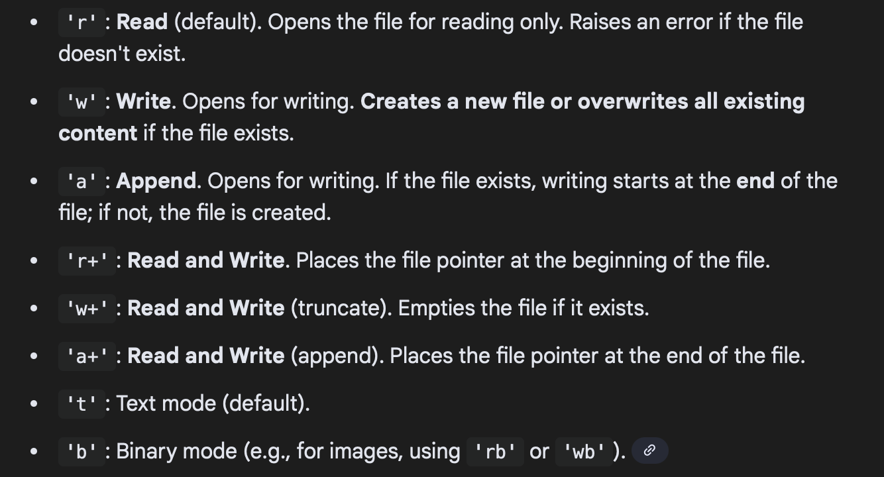

# Python Quick Revision & Test

This module covers essential Python concepts. For each topic, review the concept, study the code snippet, and then solve the test problem.

---

## 1. Indexing & Slicing
**Concept**: Accessing elements in a sequence (string, list) using integer indices. Python uses 0-based indexing.
- **Positive Index**: `0` (first) to `len-1` (last).
- **Negative Index**: `-1` (last) to `-len` (first).
- **Slicing**: `[start:stop:step]` (stop is exclusive).

### Code Snippet
```python
text = "MachineLearning"

print(text[0])      # 'M'
print(text[-1])     # 'g'
print(text[0:7])    # 'Machine'
print(text[::2])    # 'McnLrnig' (every second char)
print(text[::-1])   # 'gninraeLenihcaM' (reverse)
```

### Test Problem
**Problem**: Given the list `data = [10, 20, 30, 40, 50, 60]`, write a slice operation to extract `[50, 40, 30]`.
<details>
<summary>Solution</summary>

```python
data = [10, 20, 30, 40, 50, 60]
result = data[4:1:-1]
print(result) # Output: [50, 40, 30]
# Explanation: Start at index 4 (value 50), go down to index 1 (value 20, excluded), step -1.
```
</details>

---

## 2. Lists & Tuples
**Concept**:
- **List**: Mutable sequence `[]`. Can be modified.
- **Tuple**: Immutable sequence `()`. Cannot be changed after creation.

### Code Snippet
```python
# List
my_list = [1, 2, 3]
my_list[0] = 100    # OK: [100, 2, 3]

# Tuple
my_tuple = (1, 2, 3)
# my_tuple[0] = 100 # Error: 'tuple' object does not support item assignment
```

### Test Problem
**Problem**: You have a tuple `point = (10, 20)`. Write code to swap these coordinates so you get `(20, 10)` in a new tuple variable named `swapped_point`.
<details>
<summary>Solution</summary>

```python
point = (10, 20)
# Option 1: Manual unpacking and packing
x, y = point
swapped_point = (y, x)

# Option 2: Slicing with reverse step
swapped_point = point[::-1]

print(swapped_point) # (20, 10)
```
</details>

---

## 3. Dictionaries
**Concept**: Key-Value pairs `{key: value}`. Keys must be immutable (strings, numbers, tuples). Values can be anything. Efficient lookups.

### Code Snippet
```python
user = {"name": "Alice", "age": 25}

user["job"] = "Engineer" # Add new key
print(user.get("age"))   # 25
print(user.get("salary", 0)) # Return 0 if key not found (safe access)

for k, v in user.items():
    print(f"{k}: {v}")
```

### Test Problem
**Problem**: Given `scores = {'math': 90, 'physics': 80}`, write a script to increase the 'physics' score by 5. If 'chemistry' is missing, add it with a score of 70.
<details>
<summary>Solution</summary>

```python
scores = {'math': 90, 'physics': 80}

# Increase physics
scores['physics'] += 5

# Add chemistry if missing
if 'chemistry' not in scores:
    scores['chemistry'] = 70

print(scores)
# Output: {'math': 90, 'physics': 85, 'chemistry': 70}
```
</details>

---

## 4. Sets
**Concept**: Unordered collection of *unique* elements `{}`. Useful for removing duplicates and set operations (union, intersection).

### Code Snippet
```python
nums = {1, 2, 2, 3} 
print(nums) # {1, 2, 3} (duplicates removed)

a = {1, 2}
b = {2, 3}

print(a & b) # Intersection: {2}
print(a | b) # Union: {1, 2, 3}
print(a - b) # Difference: {1}
```

### Test Problem
**Problem**: You have two lists of IDs: `group_A = [1, 5, 10]` and `group_B = [5, 20, 10]`. Find the unique IDs that are present in both groups.
<details>
<summary>Solution</summary>

```python
group_A = [1, 5, 10]
group_B = [5, 20, 10]

common_ids = set(group_A) & set(group_B)
print(common_ids) # Output: {10, 5}
```
</details>

---

## 5. Conditions and Branching
**Concept**: `if`, `elif`, `else` blocks to control flow based on boolean logic (`True`/`False`).

### Code Snippet
```python
x = 10

if x > 20:
    print("Greater than 20")
elif x > 5:
    print("Between 5 and 20")
else:
    print("5 or less")
```

### Test Problem
**Problem**: Write a condition that prints "Valid" if a variable `voltage` is between 3.0 and 5.0 (inclusive), otherwise print "Warning".
<details>
<summary>Solution</summary>

```python
voltage = 4.2

# Python supports chained comparison
if 3.0 <= voltage <= 5.0:
    print("Valid")
else:
    print("Warning")
```
</details>

---

## 6. Loops
**Concept**:
- **For Loop**: Iterate over a sequence.
- **While Loop**: Repeat while a condition is true.

### Code Snippet
```python
# For loop
for i in range(3):
    print(f"Count {i}")

# While loop
n = 3
while n > 0:
    print(n)
    n -= 1
```

### Test Problem
**Problem**: Write a loop that sums all even numbers from 1 to 10 (inclusive).
<details>
<summary>Solution</summary>

```python
total = 0
# Option 1
for i in range(1, 11):
    if i % 2 == 0:
        total += i

# Option 2 (Cleaner)
for i in range(2, 11, 2):
    total += i

print(total) # Output: 30 (2+4+6+8+10)
```
</details>

---

## 7. Try / Except (Error Handling)
**Concept**: Catch errors so the program doesn't crash.

### Code Snippet
```python
try:
    x = 10 / 0
except ZeroDivisionError:
    print("Cannot divide by zero!")
except Exception as e:
    print(f"Some other error: {e}")
finally:
    print("This runs no matter what.")
```

### Test Problem
**Problem**: Write a function `safe_int(s)` that converts a string `s` to an integer. If the string is not a valid number (like "abc"), return -1 instead of crashing.
<details>
<summary>Solution</summary>

```python
def safe_int(s):
    try:
        return int(s)
    except ValueError:
        return -1

print(safe_int("123"))   # 123
print(safe_int("hello")) # -1
```
</details>

---

## 8. Classes and Objects (OOP)
**Concept**: Encapsulate data (attributes) and behavior (methods) into a class. `__init__` is the constructor.

### Code Snippet
```python
class Robot:
    def __init__(self, name):
        self.name = name # Attribute
    
    def say_hello(self): # Method
        print(f"I am {self.name}")

r1 = Robot("R2D2")
r1.say_hello()
```

### Test Problem
**Problem**: Create a class `Rectangle` with `width` and `height`. Add a method `area()` that returns the area. Create an instance with width=5, height=10 and print its area.
<details>
<summary>Solution</summary>

```python
class Rectangle:
    def __init__(self, width, height):
        self.width = width
        self.height = height
    
    def area(self):
        return self.width * self.height

rect = Rectangle(5, 10)
print(rect.area()) # Output: 50
```
</details>

---

## 9. Read and Write Files
**Concept**: Use `open()` with `with` statement (context manager) to handle files safely.
- `'w'`: Write (overwrites).
- `'r'`: Read.
- `'a'`: Append.


### Code Snippet
```python
# Writing
with open('test.txt', 'w') as f:
    f.write("Hello World\n")
    f.write("Line 2")

# Reading
with open('test.txt', 'r') as f:
    content = f.read()
    print(content)
```

### Test Problem
**Problem**: Write a code block that reads a file `data.txt`. Count how many lines contain the word "error". (Assume `data.txt` generally exists, but just write the logic).
<details>
<summary>Solution</summary>

```python
# Assuming data.txt exists
count = 0
try:
    with open('data.txt', 'r') as f:
        for line in f:
            if "error" in line.lower():
                count += 1
    print(f"Found {count} error lines.")
except FileNotFoundError:
    print("File not found.")
```
</details>
