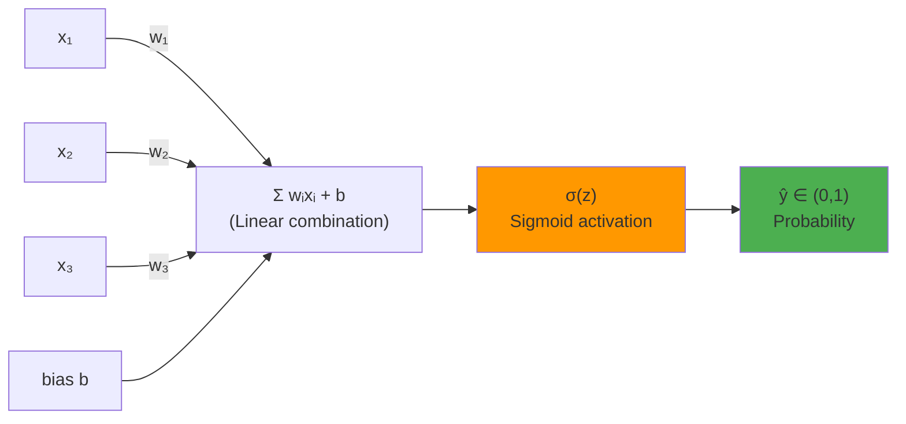
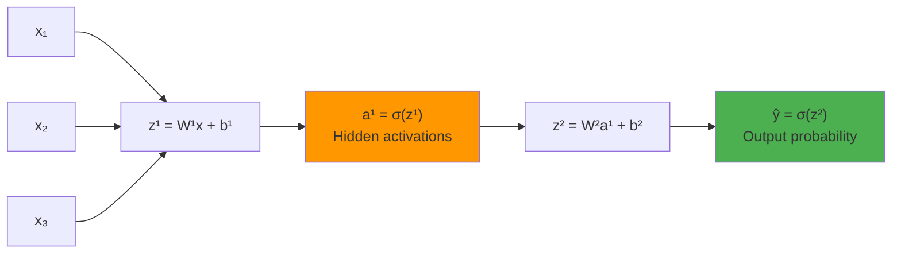
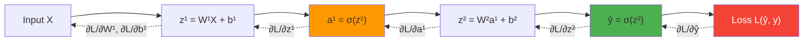
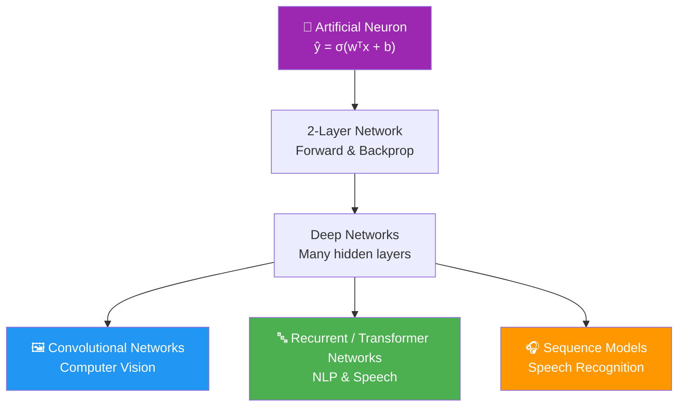

# 4.1 — Neural Networks: From Neurons to Networks

## 📚 Introduction

Welcome! You've just conquered the fundamentals of machine learning — linear regression, logistic regression, gradient descent, evaluation metrics, and more. Now we cross an important threshold: **Neural Networks**.

Neural Networks are the engine behind nearly every modern AI breakthrough — from ChatGPT understanding your questions, to your phone unlocking with your face, to Spotify predicting your next favourite song.

Here's the exciting part: **you already know more than you think.** Neural Networks are, at their core, a organised collection of the same logistic regression units you've already mastered — just stacked, layered, and connected in a way that gives them remarkable power.

In this lesson, you will:

- Understand what a biological and artificial neuron is
- See how logistic regression *is* a single artificial neuron
- Build intuition for binary classification with a neural network
- Understand computation graphs and how information flows
- Implement a neuron from scratch
- Explore real-world applications of NNs
- Be tested with deep-thinking Q&A exercises

> [!NOTE]
> Before you dive in, make sure you're comfortable with:
> - Logistic regression and the sigmoid function
> - Cost functions (log loss)
> - Gradient descent and partial derivatives

---

## 🧠 Part 1: What is a Neuron?

### 1.1 The Biological Inspiration

Your brain contains roughly **86 billion neurons**. Each neuron:

1. **Receives signals** from other neurons through dendrites
2. **Integrates** those signals in its cell body (soma)
3. **Fires** (or doesn't) depending on whether the combined signal crosses a threshold
4. **Transmits** its output along its axon to the next neuron

```
         Dendrites (inputs)
              │  │  │
    ──────────▼──▼──▼──────────
    │                          │
    │   Soma (Cell Body)       │─────────►  Axon (output)
    │   [sums & decides]       │
    ──────────────────────────
```

The key insight: **a neuron is a decision unit**. It takes many inputs, weighs their importance, sums them up, and either fires or doesn't.

---

### 1.2 The Artificial Neuron

An artificial neuron mimics exactly this structure:

```
             x₁ ──w₁──┐
             x₂ ──w₂──┤
             x₃ ──w₃──┼──► [ Σ wᵢxᵢ + b ] ──► [ activation f ] ──► output ŷ
              •   •    │
              •   •    │
             xₙ ──wₙ──┘
```

**Step by step:**

| Step | Name | What happens |
|------|------|-------------|
| 1 | **Input** | Receive feature values $x_1, x_2, \ldots, x_n$ |
| 2 | **Weighting** | Multiply each input by its learned weight $w_i$ |
| 3 | **Summation** | Add everything up: $z = w_1x_1 + w_2x_2 + \cdots + w_nx_n + b$ |
| 4 | **Activation** | Pass $z$ through a function $f(z)$ that determines the output |
| 5 | **Output** | Produce $\hat{y} = f(z)$ |

The **linear combination** is:

$$z = \mathbf{w}^T \mathbf{x} + b = \sum_{i=1}^{n} w_i x_i + b$$

The **output** depends on the activation function chosen.

---

### 1.3 Why Do Neurons Work?

Neurons are powerful because:

1. **Weights encode importance** — a larger $|w_i|$ means feature $x_i$ matters more. A negative weight means the feature works against the output.

2. **Bias shifts the decision boundary** — without $b$, the decision boundary must pass through the origin. $b$ gives the neuron freedom to shift.

3. **Activation functions add non-linearity** — without them, stacking many neurons would still just be linear algebra. Non-linear activations let networks learn complex patterns.

4. **They are learnable** — weights and biases are tuned through gradient descent so the neuron gets better over time.

> [!TIP]
> Think of the weight $w_i$ as the neuron's "opinion" about how much feature $x_i$ should influence its decision. Gradient descent adjusts all these opinions until the neuron makes good predictions.

---

## 🔗 Part 2: Logistic Regression = A Single Neuron

This is one of the most important insights in all of deep learning:

> **Logistic regression is exactly a single artificial neuron with a sigmoid activation function.**

Let's see why.

### 2.1 Recall: Logistic Regression

From your previous lesson, logistic regression predicts:

$$\hat{y} = \sigma(z) = \sigma(\mathbf{w}^T \mathbf{x} + b) = \frac{1}{1 + e^{-(\mathbf{w}^T \mathbf{x} + b)}}$$

Now look at our neuron diagram again:

```
   x₁ ──w₁──┐
   x₂ ──w₂──┤
   x₃ ──w₃──┼──► z = wᵀx + b ──► σ(z) ──► ŷ ∈ (0, 1)
```

**They are identical.** The logistic regression model *is* a neuron:
- The weighted sum $z = \mathbf{w}^T \mathbf{x} + b$ is the neuron's **pre-activation**
- The sigmoid $\sigma(z)$ is the neuron's **activation function**
- The output $\hat{y}$ is the neuron's **firing rate** — a probability



### 2.2 The Sigmoid Activation

$$\sigma(z) = \frac{1}{1 + e^{-z}}$$

| $z$ | $\sigma(z)$ | Interpretation |
|-----|------------|----------------|
| very negative (e.g. -10) | ≈ 0.000045 | Neuron "off" — not firing |
| 0 | 0.5 | Neuron uncertain |
| very positive (e.g. +10) | ≈ 0.99995 | Neuron "on" — fully firing |

**Key properties:**
- Output is always in $(0, 1)$ — perfect for probabilities
- Differentiable everywhere (essential for gradient descent)
- Derivative: $\sigma'(z) = \sigma(z)(1 - \sigma(z))$ — elegant and cheap to compute

```python
import numpy as np

def sigmoid(z):
    return 1 / (1 + np.exp(-z))

# Try it
print(sigmoid(-10))  # ≈ 0.000045
print(sigmoid(0))    # 0.5
print(sigmoid(10))   # ≈ 0.99995
```

### 2.3 Implementation: A Single Neuron from Scratch

```python
import numpy as np

class Neuron:
    """
    A single artificial neuron with sigmoid activation.
    This is identical to logistic regression.
    """
    def __init__(self, n_features):
        # Initialize weights to small random values, bias to 0
        self.w = np.random.randn(n_features) * 0.01
        self.b = 0.0

    def sigmoid(self, z):
        return 1 / (1 + np.exp(-z))

    def forward(self, X):
        """
        Forward pass: compute the neuron's output.
        X: shape (m, n) — m examples, n features
        """
        z = X @ self.w + self.b      # Linear combination: z = wᵀx + b
        y_hat = self.sigmoid(z)       # Activation: ŷ = σ(z)
        return y_hat

    def compute_loss(self, y_hat, y):
        """
        Binary cross-entropy loss (log loss).
        """
        m = len(y)
        # Clip to prevent log(0)
        y_hat = np.clip(y_hat, 1e-9, 1 - 1e-9)
        loss = -(1/m) * np.sum(y * np.log(y_hat) + (1 - y) * np.log(1 - y_hat))
        return loss

    def train(self, X, y, alpha=0.1, epochs=1000):
        """
        Train with gradient descent.
        """
        m = len(y)
        loss_history = []

        for epoch in range(epochs):
            # --- Forward pass ---
            y_hat = self.forward(X)

            # --- Compute loss ---
            loss = self.compute_loss(y_hat, y)
            loss_history.append(loss)

            # --- Backward pass (gradients) ---
            error = y_hat - y                             # shape (m,)
            dw = (1/m) * X.T @ error                     # gradient w.r.t. w
            db = (1/m) * np.sum(error)                   # gradient w.r.t. b

            # --- Update parameters ---
            self.w -= alpha * dw
            self.b -= alpha * db

        return loss_history

    def predict(self, X, threshold=0.5):
        return (self.forward(X) >= threshold).astype(int)


# ──── Example usage ────
np.random.seed(42)
# 100 examples, 2 features
X = np.random.randn(100, 2)
# Label: 1 if first feature > 0, else 0
y = (X[:, 0] > 0).astype(float)

neuron = Neuron(n_features=2)
losses = neuron.train(X, y, alpha=0.1, epochs=500)

preds = neuron.predict(X)
accuracy = np.mean(preds == y)
print(f"Final loss:  {losses[-1]:.4f}")
print(f"Accuracy:    {accuracy:.2%}")
```

> [!IMPORTANT]
> Notice that `Neuron.train()` is **exactly** logistic regression with gradient descent. When you later build a neural network, you'll chain many of these neurons together — but the math of each neuron stays the same.

---

## 🎯 Part 3: Binary Classification with a Neural Network

### 3.1 The Problem

**Binary classification** asks: does this input belong to class 0 or class 1?

Examples:
- Is this email spam? (1) or not spam? (0)
- Is this tumour malignant? (1) or benign? (0)
- Does this transaction look fraudulent? (1) or genuine? (0)

With a single neuron (logistic regression), we can only learn **linear decision boundaries**. What if the data is more complex?

```
  Linear boundary          Non-linear boundary
  (one neuron)             (neural network)

   ┌─────────────┐          ┌─────────────┐
   │  ●   │  ○  │          │  ●●    ○○  │
   │  ●   │  ○  │          │ ●  ●  ○  ○│
   │──────┼─────│          │  ●●    ○○  │
   │  ●   │  ○  │          │   (curve)  │
   └─────────────┘          └─────────────┘
```

A neural network with multiple neurons can carve out **arbitrary decision boundaries** in the input space.

### 3.2 A Two-Layer Neural Network

Let's build the simplest neural network that goes beyond a single neuron — a network with:
- An **input layer** (your features)
- One **hidden layer** (intermediate neurons)
- An **output layer** (final prediction)

```
INPUT LAYER      HIDDEN LAYER         OUTPUT LAYER
                  (2 neurons)          (1 neuron)

   x₁ ──────────► h₁ ──────────────────────────┐
          ╲      ╱    ╲                          ▼
   x₂ ──────────► h₂   ──────────────────────► ŷ  (probability)
          ╱      ╲    ╱
   x₃ ──────────►
```

**Notation convention:**
- Superscript $[l]$ denotes the layer number
- $\mathbf{W}^{[1]}$, $\mathbf{b}^{[1]}$ — weights and bias for layer 1 (hidden)
- $\mathbf{W}^{[2]}$, $\mathbf{b}^{[2]}$ — weights and bias for layer 2 (output)

### 3.3 Forward Pass Through the Network

**Layer 1 (hidden layer):**

$$\mathbf{z}^{[1]} = \mathbf{W}^{[1]} \mathbf{x} + \mathbf{b}^{[1]}$$

$$\mathbf{a}^{[1]} = \sigma(\mathbf{z}^{[1]})$$

**Layer 2 (output layer):**

$$z^{[2]} = \mathbf{W}^{[2]} \mathbf{a}^{[1]} + b^{[2]}$$

$$\hat{y} = a^{[2]} = \sigma(z^{[2]})$$

Where:
- $\mathbf{W}^{[1]}$ is a matrix of shape $(n_h \times n_x)$ — $n_h$ hidden neurons, $n_x$ input features
- $\mathbf{a}^{[1]}$ is the vector of hidden layer outputs, shape $(n_h,)$
- $\mathbf{W}^{[2]}$ is shape $(1 \times n_h)$ — one output neuron
- $\hat{y}$ is a scalar probability



### 3.4 Why Hidden Layers Matter

Each hidden neuron learns a **feature detector** — it fires when it recognises a certain pattern in the input data.

Imagine classifying handwritten digits:
- Hidden neuron 1 might learn to detect **vertical edges**
- Hidden neuron 2 might learn to detect **horizontal edges**
- Hidden neuron 3 might learn to detect **curves**

The output neuron combines these detected features to make the final decision.

> [!NOTE]
> This is why deep networks (many layers) are called **deep learning** — each layer builds increasingly abstract features on top of the previous layer's outputs.

### 3.5 The Cost Function

For binary classification, we use **binary cross-entropy loss** — same as logistic regression:

$$J(\mathbf{W}, \mathbf{b}) = -\frac{1}{m} \sum_{i=1}^{m} \left[ y^{(i)} \log(\hat{y}^{(i)}) + (1 - y^{(i)}) \log(1 - \hat{y}^{(i)}) \right]$$

The goal: **minimise $J$** by updating all weights and biases across all layers using gradient descent.

---

## 📊 Part 4: Computation Graph Intuition

### 4.1 What is a Computation Graph?

A **computation graph** is a visual/conceptual tool that shows how a mathematical expression is computed step by step.

It represents:
- **Nodes** → operations or variables
- **Edges** → data flowing between them

The reason this matters: **backpropagation** (the algorithm that trains neural networks) works by traversing this graph **backwards** to compute gradients efficiently.

### 4.2 A Simple Example

Let's trace the computation graph for a single neuron predicting on one example:

Given:
- $x = 2$, $w = 3$, $b = 1$
- Goal: compute $\hat{y} = \sigma(wx + b)$, then loss $L$

**Forward pass (left → right):**

```
x=2 ──┐
       ├──► [×] ──► u = wx = 6 ──► [+] ──► z = u + b = 7 ──► [σ] ──► ŷ = σ(7)
w=3 ──┘                              ▲
                                     │
b=1 ─────────────────────────────────┘
```

Step by step:

| Node | Operation | Value |
|------|-----------|-------|
| $u$ | $w \cdot x$ | $3 \times 2 = 6$ |
| $z$ | $u + b$ | $6 + 1 = 7$ |
| $\hat{y}$ | $\sigma(z)$ | $\sigma(7) \approx 0.999$ |
| $L$ | $-[y\log\hat{y} + (1-y)\log(1-\hat{y})]$ | (depends on true label $y$) |

### 4.3 Backward Pass — Computing Gradients

Now we go **right → left** through the graph, applying the chain rule at each step.

Suppose $y = 1$ (the true label), so $L = -\log(\hat{y})$.

**Why chain rule?** Each parameter is several steps away from the loss. The chain rule lets us multiply local gradients to get the total gradient:

$$\frac{\partial L}{\partial w} = \frac{\partial L}{\partial \hat{y}} \cdot \frac{\partial \hat{y}}{\partial z} \cdot \frac{\partial z}{\partial u} \cdot \frac{\partial u}{\partial w}$$

Let's compute each piece:

$$\frac{\partial L}{\partial \hat{y}} = -\frac{1}{\hat{y}}$$

$$\frac{\partial \hat{y}}{\partial z} = \sigma'(z) = \hat{y}(1 - \hat{y})$$

$$\frac{\partial z}{\partial u} = 1$$

$$\frac{\partial u}{\partial w} = x$$

**Putting it together:**

$$\frac{\partial L}{\partial w} = -\frac{1}{\hat{y}} \cdot \hat{y}(1 - \hat{y}) \cdot 1 \cdot x = -(1 - \hat{y}) \cdot x = (\hat{y} - y) \cdot x$$

$$\frac{\partial L}{\partial b} = \hat{y} - y$$

> [!TIP]
> Notice the gradient $(\hat{y} - y)$ — it is just the **prediction error**! The bigger the mistake, the larger the gradient, and the more aggressively parameters are updated. This is elegant and intuitive.

### 4.4 The Full Computation Graph for a 2-Layer Network

```
     ┌────────────────── FORWARD PASS ──────────────────────────────────────────────┐
     │                                                                               │
  x ─┼─► W¹,b¹ ──► [z¹ = W¹x + b¹] ──► [a¹ = σ(z¹)] ──► W²,b² ──► [z² = W²a¹ + b²] ──► [ŷ = σ(z²)] ──► L
     │                                                                               │
     └────────────────── BACKWARD PASS (gradients flow right → left) ─────────────┘

  ∂L/∂W²  ←──── ∂L/∂z² ←──── ∂L/∂ŷ
  ∂L/∂W¹  ←──── ∂L/∂z¹ ←──── ∂L/∂a¹ ←──── ∂L/∂z²
```



**The backward pass (backpropagation) in order:**

1. $\delta^{[2]} = \hat{y} - y$ — output layer error
2. $\frac{\partial L}{\partial \mathbf{W}^{[2]}} = \frac{1}{m} \delta^{[2]} (\mathbf{a}^{[1]})^T$
3. $\frac{\partial L}{\partial b^{[2]}} = \frac{1}{m} \sum \delta^{[2]}$
4. $\delta^{[1]} = (\mathbf{W}^{[2]})^T \delta^{[2]} \cdot \sigma'(\mathbf{z}^{[1]})$ — hidden layer error
5. $\frac{\partial L}{\partial \mathbf{W}^{[1]}} = \frac{1}{m} \delta^{[1]} \mathbf{X}^T$
6. $\frac{\partial L}{\partial \mathbf{b}^{[1]}} = \frac{1}{m} \sum \delta^{[1]}$

Then update each parameter: $\theta \leftarrow \theta - \alpha \frac{\partial L}{\partial \theta}$

### 4.5 Implementation: 2-Layer Neural Network

```python
import numpy as np

class TwoLayerNN:
    """
    A minimal 2-layer neural network for binary classification.
    Architecture: [n_x] → [n_h] → [1]
    """

    def __init__(self, n_x, n_h):
        """
        n_x: number of input features
        n_h: number of hidden neurons
        """
        # He initialization (better than zeros for deep networks)
        self.W1 = np.random.randn(n_h, n_x) * np.sqrt(2 / n_x)
        self.b1 = np.zeros((n_h, 1))
        self.W2 = np.random.randn(1, n_h) * np.sqrt(2 / n_h)
        self.b2 = np.zeros((1, 1))

    def sigmoid(self, z):
        return 1 / (1 + np.exp(-np.clip(z, -500, 500)))

    def forward(self, X):
        """
        X: shape (n_x, m) — n_x features, m examples
        Returns ŷ and cache for backprop
        """
        # Layer 1
        Z1 = self.W1 @ X + self.b1       # (n_h, m)
        A1 = self.sigmoid(Z1)             # (n_h, m)

        # Layer 2
        Z2 = self.W2 @ A1 + self.b2      # (1, m)
        A2 = self.sigmoid(Z2)             # (1, m)  ← this is ŷ

        cache = (X, Z1, A1, Z2, A2)
        return A2, cache

    def compute_loss(self, A2, y):
        """Binary cross-entropy loss"""
        m = y.shape[1]
        A2 = np.clip(A2, 1e-9, 1 - 1e-9)
        loss = -(1/m) * np.sum(y * np.log(A2) + (1 - y) * np.log(1 - A2))
        return loss

    def backward(self, cache, y):
        """Compute gradients via backpropagation"""
        X, Z1, A1, Z2, A2 = cache
        m = y.shape[1]

        # Output layer gradients
        dZ2 = A2 - y                                  # (1, m)
        dW2 = (1/m) * dZ2 @ A1.T                     # (1, n_h)
        db2 = (1/m) * np.sum(dZ2, axis=1, keepdims=True)

        # Hidden layer gradients (chain rule through sigmoid)
        dA1 = self.W2.T @ dZ2                         # (n_h, m)
        dZ1 = dA1 * A1 * (1 - A1)                    # element-wise: σ'(z) = σ(z)(1-σ(z))
        dW1 = (1/m) * dZ1 @ X.T                      # (n_h, n_x)
        db1 = (1/m) * np.sum(dZ1, axis=1, keepdims=True)

        return dW1, db1, dW2, db2

    def train(self, X, y, alpha=0.1, epochs=1000, print_every=100):
        """
        X: shape (n_x, m)
        y: shape (1, m)
        """
        loss_history = []

        for epoch in range(epochs):
            # Forward pass
            A2, cache = self.forward(X)

            # Compute loss
            loss = self.compute_loss(A2, y)
            loss_history.append(loss)

            # Backward pass
            dW1, db1, dW2, db2 = self.backward(cache, y)

            # Update parameters
            self.W1 -= alpha * dW1
            self.b1 -= alpha * db1
            self.W2 -= alpha * dW2
            self.b2 -= alpha * db2

            if epoch % print_every == 0:
                print(f"Epoch {epoch:4d} | Loss: {loss:.4f}")

        return loss_history

    def predict(self, X, threshold=0.5):
        A2, _ = self.forward(X)
        return (A2 >= threshold).astype(int)


# ──── Example: XOR problem (not linearly separable!) ────
# XOR cannot be solved by a single neuron — it needs a hidden layer
X = np.array([[0, 0, 1, 1],
              [0, 1, 0, 1]])          # shape (2, 4)
y = np.array([[0, 1, 1, 0]])          # XOR labels, shape (1, 4)

model = TwoLayerNN(n_x=2, n_h=4)
losses = model.train(X, y, alpha=1.0, epochs=5000, print_every=1000)

preds = model.predict(X)
print(f"\nPredictions: {preds}")       # Should match y = [0, 1, 1, 0]
print(f"Accuracy:    {np.mean(preds == y):.0%}")
```

> [!IMPORTANT]
> The **XOR problem** is a classic example. A single neuron (logistic regression) **cannot** solve it — it requires a non-linear decision boundary. A 2-layer network with a hidden layer solves it easily. This is the key advantage of neural networks over logistic regression.

---

## 🌍 Part 5: Real-World Applications

Neural networks power the most impactful AI applications of our time. Here's how the same ideas you've learned apply:

### 5.1 Computer Vision (CV)

**What it does:** Understands images — classifying, detecting objects, generating images.

**Applications:**
- Facial recognition (your phone's Face ID)
- Medical imaging (detecting cancer in X-rays)
- Self-driving cars (detecting pedestrians, signs)
- Quality control in manufacturing

**How NNs are used:**
- Input: pixel values of an image (e.g. 224×224×3 = 150,528 features)
- Hidden layers: learn edge detectors → shape detectors → object detectors
- Output: class probabilities (e.g. "cat: 92%, dog: 6%, bird: 2%")

### 5.2 Natural Language Processing (NLP)

**What it does:** Understands and generates human language.

**Applications:**
- Machine translation (Google Translate)
- Sentiment analysis ("Is this review positive or negative?")
- Question answering (ChatGPT, Gemini)
- Text summarisation
- Named entity recognition

**How NNs are used:**
- Input: words converted to numerical vectors (embeddings)
- Hidden layers: learn grammar, context, and meaning
- Output: next word probability, sentiment class, answer text, etc.

### 5.3 Speech Recognition & Generation

**What it does:** Converts audio to text (and text to audio).

**Applications:**
- Voice assistants (Siri, Google Assistant, Alexa)
- Transcription services (Otter.ai, Whisper)
- Voice cloning and text-to-speech

**How NNs are used:**
- Input: audio waveform converted to spectrogram (frequency over time)
- Hidden layers: learn phonemes → words → sentences
- Output: character or word probabilities → transcribed text

### 5.4 How They All Share the Same Foundation



> [!NOTE]
> You'll study CNNs, RNNs, and Transformers in later lessons. For now, know that every one of them is built from the same building blocks: neurons, weighted sums, activation functions, forward pass, loss, and backpropagation.

---

## 📝 Summary: What We've Learned

| Concept | Key Takeaway |
|---------|--------------|
| 🧠 **Neuron** | Weighted sum of inputs → activation function → output |
| 🔗 **Logistic Regression = Neuron** | Sigmoid activation makes it a binary classifier |
| 🏗️ **Neural Network** | Stack of neurons organised in layers |
| 📊 **Computation Graph** | Visual representation of operations; enables backprop |
| ⬅️ **Backpropagation** | Chain rule applied right-to-left to compute all gradients |
| 🌍 **Applications** | CV, NLP, Speech — all built on these foundations |

---

## 🧪 Q&A — Test Your Understanding

Work through these carefully. Don't just read the answer — try to reason through it first.

---

### Q1: Connecting to What You Know

**Question:** A logistic regression model trained on 3 features has weights $w_1 = 0.9$, $w_2 = 0.1$, $w_3 = -0.8$ and bias $b = 0.2$.

1. Which feature does this neuron consider most important, and in which direction?
2. If $x = [1, 0.5, 2]$, what is $z$? What is $\hat{y}$?
3. If the true label is $y = 0$, is the neuron making a good prediction?

<details>
<summary>💡 Hint</summary>

For (1), look at the magnitude and sign of each weight. For (2), compute $z = w_1x_1 + w_2x_2 + w_3x_3 + b$, then apply sigmoid. For (3), compare $\hat{y}$ to $y = 0$ — the closer $\hat{y}$ is to 0, the better.

</details>

<details>
<summary>✅ Answer</summary>

**1.** Feature $x_1$ has the largest magnitude weight ($|w_1| = 0.9$), making it most influential and **positively** contributing to the output. Feature $x_3$ is second-most important but **negatively** pushes the output toward 0.

**2.**
$$z = (0.9)(1) + (0.1)(0.5) + (-0.8)(2) + 0.2$$
$$z = 0.9 + 0.05 - 1.6 + 0.2 = -0.45$$
$$\hat{y} = \sigma(-0.45) = \frac{1}{1 + e^{0.45}} \approx 0.389$$

**3.** $\hat{y} \approx 0.389$ and $y = 0$. The neuron is somewhat close (predicts class 0 since $\hat{y} < 0.5$) but not confidently. The loss is non-zero and gradient descent will continue to adjust the weights.

</details>

---

### Q2: Why Layers?

**Question:** A student argues: *"If I just make my weights larger, a single neuron can learn anything — I don't need multiple layers."*

Is this student correct? Why or why not? Give a concrete example of a problem a single neuron **cannot** solve, regardless of weight values.

<details>
<summary>💡 Hint</summary>

Think about the decision boundary a single neuron can create. What shape is it? Is there a dataset whose classes cannot be separated by that shape?

</details>

<details>
<summary>✅ Answer</summary>

**No, the student is incorrect.** A single neuron with sigmoid activation (logistic regression) always learns a **linear decision boundary**. No matter how large or small the weights are, the boundary is always of the form:

$$\mathbf{w}^T \mathbf{x} + b = 0$$

This is a straight line (in 2D), a plane (in 3D), or a hyperplane in general.

**Concrete counterexample — XOR:**

| $x_1$ | $x_2$ | XOR |
|-------|-------|-----|
| 0 | 0 | 0 |
| 0 | 1 | 1 |
| 1 | 0 | 1 |
| 1 | 1 | 0 |

You cannot draw a single straight line that separates the 1s from the 0s in XOR. This is a **non-linearly separable** problem. A neural network with at least one hidden layer can solve it.

This is the **fundamental motivation** for neural networks over a single logistic regression neuron.

</details>

---

### Q3: Computation Graph Tracing

**Question:** For a single neuron, you are given:
- $x_1 = 1$, $x_2 = -1$
- $w_1 = 2$, $w_2 = 1$, $b = 0$
- True label: $y = 1$

Trace the **full forward pass** step by step and compute the loss $L = -\log(\hat{y})$.

Then, **without looking at the formulas**, use the chain rule to find $\frac{\partial L}{\partial w_1}$.

<details>
<summary>💡 Hint</summary>

Forward: compute $u_1 = w_1 x_1$, $u_2 = w_2 x_2$, then $z = u_1 + u_2 + b$, then $\hat{y} = \sigma(z)$, then $L$.

Backward: $\frac{\partial L}{\partial w_1} = \frac{\partial L}{\partial \hat{y}} \cdot \frac{\partial \hat{y}}{\partial z} \cdot \frac{\partial z}{\partial u_1} \cdot \frac{\partial u_1}{\partial w_1}$

</details>

<details>
<summary>✅ Answer</summary>

**Forward pass:**

| Step | Expression | Value |
|------|-----------|-------|
| $u_1 = w_1 x_1$ | $2 \times 1$ | $2$ |
| $u_2 = w_2 x_2$ | $1 \times (-1)$ | $-1$ |
| $z = u_1 + u_2 + b$ | $2 + (-1) + 0$ | $1$ |
| $\hat{y} = \sigma(1)$ | $\frac{1}{1+e^{-1}}$ | $\approx 0.731$ |
| $L = -\log(\hat{y})$ | $-\log(0.731)$ | $\approx 0.313$ |

**Backward pass (chain rule):**

$$\frac{\partial L}{\partial \hat{y}} = -\frac{1}{\hat{y}} = -\frac{1}{0.731} \approx -1.368$$

$$\frac{\partial \hat{y}}{\partial z} = \sigma'(z) = \hat{y}(1 - \hat{y}) = 0.731 \times 0.269 \approx 0.197$$

$$\frac{\partial z}{\partial u_1} = 1$$

$$\frac{\partial u_1}{\partial w_1} = x_1 = 1$$

$$\frac{\partial L}{\partial w_1} = (-1.368)(0.197)(1)(1) \approx -0.269$$

Note: $\frac{\partial L}{\partial w_1} \approx -(1 - \hat{y}) \cdot x_1 = (\hat{y} - y) \cdot x_1 = (0.731 - 1)(1) = -0.269$ ✓

The negative gradient means increasing $w_1$ would **decrease** the loss — gradient descent will increase $w_1$, which is correct since the neuron needs a stronger response.

</details>

---

### Q4: Shapes and Dimensions

**Question:** You're building a neural network for a medical diagnosis problem:
- Input: 10 lab test results per patient
- Hidden layer: 8 neurons
- Output: 1 probability (disease: yes/no)
- Batch size: 64 patients

State the **shape** of every matrix and vector in the forward pass:
$\mathbf{X}$, $\mathbf{W}^{[1]}$, $\mathbf{b}^{[1]}$, $\mathbf{Z}^{[1]}$, $\mathbf{A}^{[1]}$, $\mathbf{W}^{[2]}$, $\mathbf{b}^{[2]}$, $\mathbf{Z}^{[2]}$, $\mathbf{A}^{[2]}$

<details>
<summary>💡 Hint</summary>

Convention: $\mathbf{X}$ is $(n_x \times m)$ where $n_x$ = features and $m$ = examples. $\mathbf{W}^{[l]}$ has shape $(n_l \times n_{l-1})$ so that $\mathbf{W}^{[l]} \mathbf{A}^{[l-1]}$ works out correctly.

</details>

<details>
<summary>✅ Answer</summary>

| Tensor | Shape | Why |
|--------|-------|-----|
| $\mathbf{X}$ | $(10, 64)$ | 10 features, 64 patients |
| $\mathbf{W}^{[1]}$ | $(8, 10)$ | 8 hidden neurons, each with 10 weights |
| $\mathbf{b}^{[1]}$ | $(8, 1)$ | one bias per hidden neuron (broadcasts over batch) |
| $\mathbf{Z}^{[1]} = \mathbf{W}^{[1]}\mathbf{X} + \mathbf{b}^{[1]}$ | $(8, 64)$ | each of 64 patients has 8 pre-activations |
| $\mathbf{A}^{[1]} = \sigma(\mathbf{Z}^{[1]})$ | $(8, 64)$ | hidden layer outputs |
| $\mathbf{W}^{[2]}$ | $(1, 8)$ | output neuron with 8 weights (one per hidden neuron) |
| $\mathbf{b}^{[2]}$ | $(1, 1)$ | one bias for output neuron |
| $\mathbf{Z}^{[2]} = \mathbf{W}^{[2]}\mathbf{A}^{[1]} + \mathbf{b}^{[2]}$ | $(1, 64)$ | one pre-activation per patient |
| $\mathbf{A}^{[2]} = \sigma(\mathbf{Z}^{[2]})$ | $(1, 64)$ | one probability per patient |

Keeping track of shapes is essential — a shape mismatch is often the first sign of a bug.

</details>

---

### Q5: Debugging a Network

**Question:** A student trains a 2-layer neural network but notices the loss **does not decrease** at all after hundreds of epochs. The loss stays constant at exactly $\ln(2) \approx 0.693$.

What is almost certainly happening, and how do you fix it?

<details>
<summary>💡 Hint</summary>

What is the loss when $\hat{y} = 0.5$ for every single example? What initialization could cause every neuron to output 0.5?

</details>

<details>
<summary>✅ Answer</summary>

This is the **symmetry problem**, also called the **vanishing gradient with zero initialization** bug.

If all weights are initialised to **exactly 0** (or all the same value), then:

- All hidden neurons compute **identical pre-activations**: $z_1 = z_2 = \ldots = z_{n_h} = 0 + b$
- All hidden neurons output **identical activations**: $a_1 = a_2 = \ldots = \sigma(b)$
- Gradients for all hidden neurons are **identical** → all weights get the same update
- The network is forever **symmetric** — multiple neurons but they all behave as one

With $w = 0$ and $b = 0$: $\hat{y} = \sigma(0) = 0.5$ and binary cross-entropy becomes:
$$L = -[y \log(0.5) + (1-y)\log(0.5)] = \log(2) \approx 0.693$$

This matches what the student observes!

**Fix:** Use **random initialisation** for weights (e.g., small random values from a normal distribution). This breaks the symmetry.

```python
# ❌ Wrong — symmetry problem
self.W1 = np.zeros((n_h, n_x))

# ✅ Correct — break symmetry
self.W1 = np.random.randn(n_h, n_x) * 0.01
```

Biases can safely be initialised to zero — they don't cause the symmetry problem because each bias connects to only one neuron.

</details>

---

### Q6: Real-World Reasoning

**Question:** You are building a neural network to detect whether a chest X-ray shows pneumonia.

1. Is this a regression or classification problem? Binary or multi-class?
2. What activation should the output neuron use? What loss function?
3. Your dataset has 950 healthy patients and 50 pneumonia patients. What challenge does this create, and how might it affect your network's predictions?
4. A colleague says: *"I'll just use accuracy as my metric — it's the most intuitive."* Why is this potentially dangerous here?

<details>
<summary>💡 Hint</summary>

For (3), think about what a "lazy" network could do to achieve 95% accuracy without actually learning anything useful. For (4), recall the difference between accuracy, precision, and recall.

</details>

<details>
<summary>✅ Answer</summary>

**1.** This is a **binary classification** problem — each X-ray is either pneumonia (1) or healthy (0).

**2.** Output neuron: **sigmoid** activation (maps to a probability in (0,1)).
Loss function: **binary cross-entropy** (log loss).

**3.** The dataset is severely **imbalanced** (5% positive class). A network that predicts "healthy" for every single patient achieves **95% accuracy without learning anything!** This is called the **majority class baseline problem**. The network may be biased toward always predicting "healthy," missing the very patients it needs to catch.

**4.** Accuracy is dangerous here because of the imbalance. You need:
- **Recall (Sensitivity)** — out of all actual pneumonia cases, how many did we catch? Missing a true pneumonia case (false negative) has life-threatening consequences.
- **Precision** — of all patients we flagged as pneumonia, how many actually have it?
- **F1 Score** — the harmonic mean of both.
- **AUC-ROC** — measures performance across all decision thresholds.

In medical applications, **false negatives are often far more dangerous than false positives**. A model with high recall but lower precision is usually preferred — it's better to refer a healthy patient for extra testing than to miss a sick one.

</details>

---

### Q7: Code Challenge — Fill in the Blanks

**Question:** Complete the `forward` method of this neuron:

```python
import numpy as np

class SingleNeuron:
    def __init__(self, n_features):
        self.w = np.random.randn(n_features) * 0.01
        self.b = 0.0

    def forward(self, X):
        """
        X: shape (m, n_features)
        Returns ŷ: shape (m,)

        TODO:
        Step 1: Compute the linear combination z = X @ self.w + self.b
        Step 2: Apply sigmoid activation to get ŷ
        Step 3: Return ŷ
        """
        # ── YOUR CODE HERE ──
        z = _______________
        y_hat = _______________
        return y_hat

    def compute_loss(self, y_hat, y):
        m = len(y)
        y_hat = np.clip(y_hat, 1e-9, 1 - 1e-9)
        # TODO: Implement binary cross-entropy loss
        loss = _______________
        return loss
```

<details>
<summary>✅ Solution</summary>

```python
def forward(self, X):
    z = X @ self.w + self.b                    # Linear combination
    y_hat = 1 / (1 + np.exp(-z))              # Sigmoid activation
    return y_hat

def compute_loss(self, y_hat, y):
    m = len(y)
    y_hat = np.clip(y_hat, 1e-9, 1 - 1e-9)
    loss = -(1/m) * np.sum(                    # Binary cross-entropy
        y * np.log(y_hat) + (1 - y) * np.log(1 - y_hat)
    )
    return loss
```

**Test it:**
```python
np.random.seed(0)
neuron = SingleNeuron(n_features=3)
X_test = np.array([[1, 2, 3], [4, 5, 6]])
y_test = np.array([0, 1])
ŷ = neuron.forward(X_test)
loss = neuron.compute_loss(ŷ, y_test)
print(f"Predictions: {ŷ}")
print(f"Loss:        {loss:.4f}")
```

</details>

---

## 🎓 Key Takeaways

> [!IMPORTANT]
> **Core Concepts to Carry Forward**

1. **A neuron** is a weighted sum of inputs, passed through an activation function. It is the atomic building block of every neural network.

2. **Logistic regression = a single neuron** with sigmoid activation. Everything you learned about it transfers directly to neural networks.

3. **Neural networks** are neurons organised in layers. Each layer transforms the previous layer's output, enabling increasingly abstract feature detection.

4. **Binary classification** with a neural network uses a sigmoid output neuron and binary cross-entropy loss — exactly like logistic regression, but with the power of hidden layers.

5. **Computation graphs** make the chain rule concrete. Backpropagation is just the chain rule applied layer-by-layer from the loss back to the parameters.

6. **The XOR problem** is the canonical proof that single neurons are limited. Hidden layers enable non-linear decision boundaries.

7. **Initialise weights randomly** — never to all zeros. Zero initialisation causes symmetry that prevents the network from learning.

8. **Applications are everywhere**: CV, NLP, and Speech all use these same foundations — deeper, wider networks trained on massive datasets.

---

*Next Lesson → **4.2: Activation Functions & Deep Networks** — We'll explore ReLU, tanh, and why choosing the right activation function is critical for training deep networks.*
