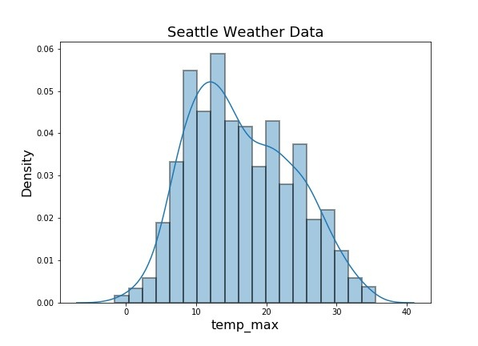
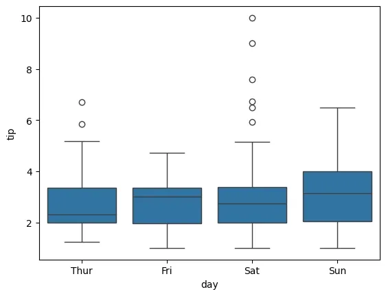
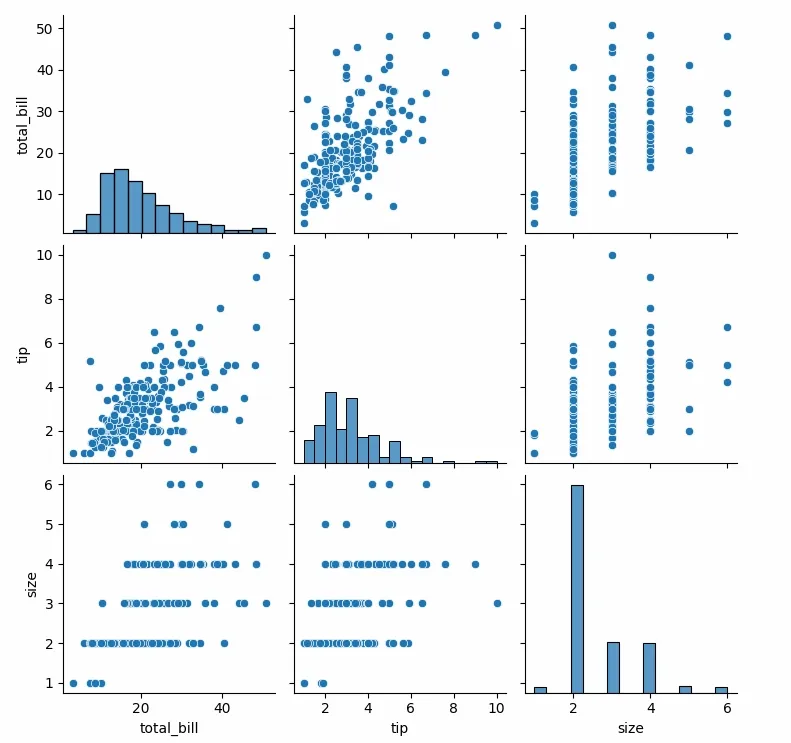

# Data Visualization Basics & NumPy Fundamentals

## Table of Contents
1. [Introduction to Data Visualization](#introduction-to-data-visualization)
2. [Visualization Libraries Overview](#visualization-libraries-overview)
3. [Plot Types and Use Cases](#plot-types-and-use-cases)
4. [NumPy Fundamentals](#numpy-fundamentals)
5. [Practice Questions](#practice-questions)

---

## Introduction to Data Visualization

**Data Visualization** is the graphical representation of information and data. In machine learning and data science, visualization serves several critical purposes:

### Why Visualize Data?

1. **Exploratory Data Analysis (EDA)**: Understand patterns, trends, and relationships
2. **Feature Understanding**: Identify correlations and distributions
3. **Outlier Detection**: Spot anomalies visually
4. **Model Evaluation**: Assess model performance
5. **Communication**: Present findings to stakeholders

### Key Principles

- **Choose the right plot** for your data type and question
- **Keep it simple**: Avoid chart junk and unnecessary complexity
- **Label clearly**: Axes, titles, and legends should be informative
- **Use color purposefully**: Highlight important information
- **Consider your audience**: Technical vs. non-technical viewers

---

## Visualization Libraries Overview

### 1. **Matplotlib**
- **Foundation**: Base library for Python visualization
- **Flexibility**: Highly customizable, fine-grained control
- **Use case**: When you need complete control over every element
- **Learning curve**: Moderate to steep

### 2. **Seaborn**
- **Built on**: Matplotlib (high-level interface)
- **Strength**: Statistical visualizations with beautiful defaults
- **Use case**: Quick, attractive statistical plots
- **Learning curve**: Gentle

### 3. **Plotly**
- **Type**: Interactive visualization library
- **Strength**: Web-based, interactive plots with hover, zoom, pan
- **Use case**: Dashboards, presentations, exploratory analysis
- **Learning curve**: Gentle to moderate

---

## Plot Types and Use Cases

### 1. Scatter Plot

**Description**: Displays values for two numerical variables as points in 2D space.

**When to use**:
- Visualize relationship between two continuous variables
- Identify correlations (positive, negative, or none)
- Detect clusters or patterns in data
- Spot outliers

**Best for**: Regression analysis, correlation analysis, clustering visualization

**Example scenario**: Plotting house prices vs. square footage to see if larger houses cost more.


#### Matplotlib Implementation

```python
import matplotlib.pyplot as plt
import numpy as np

# Sample data
x = np.random.randn(100)
y = 2 * x + np.random.randn(100) * 0.5

# Create scatter plot
plt.figure(figsize=(8, 6))
plt.scatter(x, y, alpha=0.6, c='blue', edgecolors='black')
plt.xlabel('Feature X')
plt.ylabel('Feature Y')
plt.title('Scatter Plot - Matplotlib')
plt.grid(True, alpha=0.3)
plt.show()
```

#### Seaborn Implementation

```python
import seaborn as sns
import pandas as pd
import numpy as np

# Sample data
data = pd.DataFrame({
    'x': np.random.randn(100),
    'y': 2 * np.random.randn(100) + np.random.randn(100) * 0.5
})

# Create scatter plot
plt.figure(figsize=(8, 6))
sns.scatterplot(data=data, x='x', y='y', alpha=0.6, edgecolor='black')
plt.xlabel('Feature X')
plt.ylabel('Feature Y')
plt.title('Scatter Plot - Seaborn')
plt.grid(True, alpha=0.3)
plt.show()
```

#### Plotly Implementation

```python
import plotly.express as px
import pandas as pd
import numpy as np

# Sample data
data = pd.DataFrame({
    'x': np.random.randn(100),
    'y': 2 * np.random.randn(100) + np.random.randn(100) * 0.5
})

# Create scatter plot
fig = px.scatter(data, x='x', y='y', 
                 title='Scatter Plot - Plotly',
                 labels={'x': 'Feature X', 'y': 'Feature Y'},
                 opacity=0.6)
fig.update_traces(marker=dict(size=8, line=dict(width=1, color='black')))
fig.show()
```

---

### 2. Line Plot

**Description**: Connects data points with lines, showing trends over a continuous variable (usually time).

**When to use**:
- Display trends over time (time series data)
- Show continuous change
- Visualize model predictions vs. actual values

**Best for**: Time series analysis, tracking metrics over epochs, trend analysis

**Example scenario**: Plotting training loss and validation loss over epochs during model training.


#### Matplotlib Implementation

```python
import matplotlib.pyplot as plt
import numpy as np

# Sample data
epochs = np.arange(1, 51)
train_loss = 2.5 * np.exp(-epochs / 10) + np.random.randn(50) * 0.1
val_loss = 2.5 * np.exp(-epochs / 10) + np.random.randn(50) * 0.15

# Create line plot
plt.figure(figsize=(10, 6))
plt.plot(epochs, train_loss, label='Training Loss', marker='o', linewidth=2)
plt.plot(epochs, val_loss, label='Validation Loss', marker='s', linewidth=2)
plt.xlabel('Epoch')
plt.ylabel('Loss')
plt.title('Training Progress - Matplotlib')
plt.legend()
plt.grid(True, alpha=0.3)
plt.show()
```

#### Seaborn Implementation

```python
import seaborn as sns
import pandas as pd
import numpy as np

# Sample data
epochs = np.arange(1, 51)
data = pd.DataFrame({
    'Epoch': np.concatenate([epochs, epochs]),
    'Loss': np.concatenate([
        2.5 * np.exp(-epochs / 10) + np.random.randn(50) * 0.1,
        2.5 * np.exp(-epochs / 10) + np.random.randn(50) * 0.15
    ]),
    'Type': ['Training'] * 50 + ['Validation'] * 50
})

# Create line plot
plt.figure(figsize=(10, 6))
sns.lineplot(data=data, x='Epoch', y='Loss', hue='Type', marker='o', linewidth=2)
plt.title('Training Progress - Seaborn')
plt.grid(True, alpha=0.3)
plt.show()
```

#### Plotly Implementation

```python
import plotly.graph_objects as go
import numpy as np

# Sample data
epochs = np.arange(1, 51)
train_loss = 2.5 * np.exp(-epochs / 10) + np.random.randn(50) * 0.1
val_loss = 2.5 * np.exp(-epochs / 10) + np.random.randn(50) * 0.15

# Create line plot
fig = go.Figure()
fig.add_trace(go.Scatter(x=epochs, y=train_loss, mode='lines+markers',
                         name='Training Loss', line=dict(width=2)))
fig.add_trace(go.Scatter(x=epochs, y=val_loss, mode='lines+markers',
                         name='Validation Loss', line=dict(width=2)))
fig.update_layout(title='Training Progress - Plotly',
                  xaxis_title='Epoch',
                  yaxis_title='Loss',
                  hovermode='x unified')
fig.show()
```

---

### 3. Bar Chart

**Description**: Uses rectangular bars to represent categorical data, with bar length proportional to values.

**When to use**:
- Compare quantities across categories
- Show frequency distributions of categorical variables
- Display model performance metrics across different models
- Visualize feature importance

**Best for**: Categorical comparisons, model comparison, feature importance ranking

**Example scenario**: Comparing accuracy scores of different machine learning algorithms.


#### Matplotlib Implementation

```python
import matplotlib.pyplot as plt
import numpy as np

# Sample data
models = ['Logistic\nRegression', 'Decision\nTree', 'Random\nForest', 'SVM', 'Neural\nNetwork']
accuracy = [0.82, 0.78, 0.89, 0.85, 0.91]

# Create bar chart
plt.figure(figsize=(10, 6))
bars = plt.bar(models, accuracy, color='skyblue', edgecolor='black', alpha=0.7)
plt.xlabel('Model')
plt.ylabel('Accuracy')
plt.title('Model Performance Comparison - Matplotlib')
plt.ylim(0, 1.0)
plt.grid(axis='y', alpha=0.3)

# Add value labels on bars
for bar in bars:
    height = bar.get_height()
    plt.text(bar.get_x() + bar.get_width()/2., height,
             f'{height:.2f}', ha='center', va='bottom')
plt.show()
```

#### Seaborn Implementation

```python
import seaborn as sns
import pandas as pd

# Sample data
data = pd.DataFrame({
    'Model': ['Logistic Regression', 'Decision Tree', 'Random Forest', 'SVM', 'Neural Network'],
    'Accuracy': [0.82, 0.78, 0.89, 0.85, 0.91]
})

# Create bar chart
plt.figure(figsize=(10, 6))
ax = sns.barplot(data=data, x='Model', y='Accuracy', palette='Blues_d', edgecolor='black')
plt.xlabel('Model')
plt.ylabel('Accuracy')
plt.title('Model Performance Comparison - Seaborn')
plt.ylim(0, 1.0)
plt.xticks(rotation=45, ha='right')
plt.grid(axis='y', alpha=0.3)

# Add value labels
for container in ax.containers:
    ax.bar_label(container, fmt='%.2f')
plt.tight_layout()
plt.show()
```

#### Plotly Implementation

```python
import plotly.express as px
import pandas as pd

# Sample data
data = pd.DataFrame({
    'Model': ['Logistic Regression', 'Decision Tree', 'Random Forest', 'SVM', 'Neural Network'],
    'Accuracy': [0.82, 0.78, 0.89, 0.85, 0.91]
})

# Create bar chart
fig = px.bar(data, x='Model', y='Accuracy',
             title='Model Performance Comparison - Plotly',
             text='Accuracy')
fig.update_traces(texttemplate='%{text:.2f}', textposition='outside',
                  marker_color='skyblue', marker_line_color='black', marker_line_width=1.5)
fig.update_layout(yaxis_range=[0, 1.0])
fig.show()
```

---

### 4. Histogram

**Description**: Shows the distribution of a single numerical variable by dividing data into bins and counting frequencies.

**When to use**:
- Understand the distribution of a continuous variable
- Check for normality, skewness, or multimodality
- Identify the range and spread of data
- Detect outliers

**Best for**: Distribution analysis, data preprocessing decisions, understanding feature characteristics

**Example scenario**: Visualizing the distribution of ages in a customer dataset to decide on binning strategy.



#### Matplotlib Implementation

```python
import matplotlib.pyplot as plt
import numpy as np

# Sample data (bimodal distribution)
data = np.concatenate([np.random.normal(25, 5, 500), 
                       np.random.normal(55, 8, 500)])

# Create histogram
plt.figure(figsize=(10, 6))
plt.hist(data, bins=30, color='coral', edgecolor='black', alpha=0.7)
plt.xlabel('Age')
plt.ylabel('Frequency')
plt.title('Age Distribution - Matplotlib')
plt.grid(axis='y', alpha=0.3)
plt.show()
```

#### Seaborn Implementation

```python
import seaborn as sns
import numpy as np

# Sample data
data = np.concatenate([np.random.normal(25, 5, 500), 
                       np.random.normal(55, 8, 500)])

# Create histogram
plt.figure(figsize=(10, 6))
sns.histplot(data, bins=30, color='coral', edgecolor='black', kde=True)
plt.xlabel('Age')
plt.ylabel('Frequency')
plt.title('Age Distribution - Seaborn')
plt.grid(axis='y', alpha=0.3)
plt.show()
```

#### Plotly Implementation

```python
import plotly.express as px
import pandas as pd
import numpy as np

# Sample data
data = pd.DataFrame({
    'Age': np.concatenate([np.random.normal(25, 5, 500), 
                          np.random.normal(55, 8, 500)])
})

# Create histogram
fig = px.histogram(data, x='Age', nbins=30,
                   title='Age Distribution - Plotly',
                   labels={'Age': 'Age', 'count': 'Frequency'})
fig.update_traces(marker_color='coral', marker_line_color='black', marker_line_width=1.5)
fig.show()
```

---

### 5. Box Plot

**Description**: Displays the distribution of data through quartiles, showing median, quartiles, and outliers.

**When to use**:
- Compare distributions across multiple categories
- Identify outliers
- Understand data spread and skewness
- Compare feature distributions before/after preprocessing

**Best for**: Outlier detection, comparing distributions, understanding data spread

**Example scenario**: Comparing salary distributions across different job roles to identify outliers.

**Box Plot Components**:
- **Box**: Interquartile range (IQR) - middle 50% of data
- **Line in box**: Median (50th percentile)
- **Whiskers**: Extend to 1.5 × IQR from quartiles
- **Points beyond whiskers**: Outliers



#### Matplotlib Implementation

```python
import matplotlib.pyplot as plt
import numpy as np

# Sample data
np.random.seed(42)
data = [np.random.normal(100, 10, 200),
        np.random.normal(120, 15, 200),
        np.random.normal(90, 12, 200),
        np.random.normal(110, 20, 200)]

# Create box plot
plt.figure(figsize=(10, 6))
plt.boxplot(data, labels=['Group A', 'Group B', 'Group C', 'Group D'],
            patch_artist=True,
            boxprops=dict(facecolor='lightblue', color='black'),
            medianprops=dict(color='red', linewidth=2))
plt.ylabel('Value')
plt.title('Distribution Comparison - Matplotlib')
plt.grid(axis='y', alpha=0.3)
plt.show()
```

#### Seaborn Implementation

```python
import seaborn as sns
import pandas as pd
import numpy as np

# Sample data
np.random.seed(42)
data = pd.DataFrame({
    'Group': np.repeat(['Group A', 'Group B', 'Group C', 'Group D'], 200),
    'Value': np.concatenate([
        np.random.normal(100, 10, 200),
        np.random.normal(120, 15, 200),
        np.random.normal(90, 12, 200),
        np.random.normal(110, 20, 200)
    ])
})

# Create box plot
plt.figure(figsize=(10, 6))
sns.boxplot(data=data, x='Group', y='Value', palette='Set2')
plt.ylabel('Value')
plt.title('Distribution Comparison - Seaborn')
plt.grid(axis='y', alpha=0.3)
plt.show()
```

#### Plotly Implementation

```python
import plotly.express as px
import pandas as pd
import numpy as np

# Sample data
np.random.seed(42)
data = pd.DataFrame({
    'Group': np.repeat(['Group A', 'Group B', 'Group C', 'Group D'], 200),
    'Value': np.concatenate([
        np.random.normal(100, 10, 200),
        np.random.normal(120, 15, 200),
        np.random.normal(90, 12, 200),
        np.random.normal(110, 20, 200)
    ])
})

# Create box plot
fig = px.box(data, x='Group', y='Value',
             title='Distribution Comparison - Plotly',
             color='Group')
fig.show()
```

---

### 6. Heatmap

**Description**: Represents data in a matrix format where values are encoded as colors.

**When to use**:
- Visualize correlation matrices
- Display confusion matrices
- Show patterns in 2D data (e.g., time vs. day of week)
- Visualize feature relationships

**Best for**: Correlation analysis, confusion matrix visualization, pattern detection in matrices

**Example scenario**: Displaying correlation between features to identify multicollinearity before training a model.


#### Matplotlib Implementation

```python
import matplotlib.pyplot as plt
import numpy as np

# Sample correlation matrix
np.random.seed(42)
features = ['Age', 'Income', 'Credit Score', 'Debt', 'Savings']
corr_matrix = np.random.rand(5, 5)
corr_matrix = (corr_matrix + corr_matrix.T) / 2  # Make symmetric
np.fill_diagonal(corr_matrix, 1)  # Diagonal = 1

# Create heatmap
plt.figure(figsize=(8, 6))
im = plt.imshow(corr_matrix, cmap='coolwarm', aspect='auto', vmin=-1, vmax=1)
plt.colorbar(im, label='Correlation')
plt.xticks(range(len(features)), features, rotation=45, ha='right')
plt.yticks(range(len(features)), features)
plt.title('Feature Correlation Heatmap - Matplotlib')

# Add correlation values
for i in range(len(features)):
    for j in range(len(features)):
        plt.text(j, i, f'{corr_matrix[i, j]:.2f}',
                ha='center', va='center', color='black')
plt.tight_layout()
plt.show()
```

#### Seaborn Implementation

```python
import seaborn as sns
import pandas as pd
import numpy as np

# Sample correlation matrix
np.random.seed(42)
features = ['Age', 'Income', 'Credit Score', 'Debt', 'Savings']
corr_matrix = np.random.rand(5, 5)
corr_matrix = (corr_matrix + corr_matrix.T) / 2
np.fill_diagonal(corr_matrix, 1)
corr_df = pd.DataFrame(corr_matrix, index=features, columns=features)

# Create heatmap
plt.figure(figsize=(8, 6))
sns.heatmap(corr_df, annot=True, cmap='coolwarm', center=0,
            vmin=-1, vmax=1, square=True, linewidths=1,
            cbar_kws={'label': 'Correlation'})
plt.title('Feature Correlation Heatmap - Seaborn')
plt.tight_layout()
plt.show()
```

#### Plotly Implementation

```python
import plotly.express as px
import pandas as pd
import numpy as np

# Sample correlation matrix
np.random.seed(42)
features = ['Age', 'Income', 'Credit Score', 'Debt', 'Savings']
corr_matrix = np.random.rand(5, 5)
corr_matrix = (corr_matrix + corr_matrix.T) / 2
np.fill_diagonal(corr_matrix, 1)

# Create heatmap
fig = px.imshow(corr_matrix,
                labels=dict(x="Features", y="Features", color="Correlation"),
                x=features,
                y=features,
                color_continuous_scale='RdBu_r',
                aspect='auto',
                title='Feature Correlation Heatmap - Plotly',
                zmin=-1, zmax=1)
fig.update_traces(text=np.round(corr_matrix, 2), texttemplate='%{text}')
fig.show()
```

---

### 7. Pair Plot

**Description**: Creates a grid of scatter plots for all pairs of numerical variables, with histograms on the diagonal.

**When to use**:
- Explore relationships between multiple variables simultaneously
- Identify correlations across all feature pairs
- Detect patterns and clusters
- Quick overview of multivariate data

**Best for**: Initial exploratory data analysis, feature selection, understanding multivariate relationships

**Example scenario**: Exploring the Iris dataset to understand how petal length, petal width, sepal length, and sepal width relate to each other.

> [!NOTE]
> Pair plots are primarily a Seaborn specialty. Matplotlib and Plotly require more manual setup.



#### Matplotlib Implementation

```python
import matplotlib.pyplot as plt
import numpy as np
import pandas as pd

# Sample data
np.random.seed(42)
data = pd.DataFrame({
    'Feature1': np.random.randn(100),
    'Feature2': np.random.randn(100) * 2 + 1,
    'Feature3': np.random.randn(100) * 0.5 - 1
})

# Create pair plot manually
fig, axes = plt.subplots(3, 3, figsize=(12, 12))
features = data.columns

for i, feat1 in enumerate(features):
    for j, feat2 in enumerate(features):
        ax = axes[i, j]
        if i == j:
            # Diagonal: histogram
            ax.hist(data[feat1], bins=20, color='skyblue', edgecolor='black')
            ax.set_ylabel('Frequency')
        else:
            # Off-diagonal: scatter plot
            ax.scatter(data[feat2], data[feat1], alpha=0.5)
        
        if i == len(features) - 1:
            ax.set_xlabel(feat2)
        if j == 0:
            ax.set_ylabel(feat1)

plt.suptitle('Pair Plot - Matplotlib', y=1.00)
plt.tight_layout()
plt.show()
```

#### Seaborn Implementation

```python
import seaborn as sns
import numpy as np
import pandas as pd

# Sample data
np.random.seed(42)
data = pd.DataFrame({
    'Feature1': np.random.randn(100),
    'Feature2': np.random.randn(100) * 2 + 1,
    'Feature3': np.random.randn(100) * 0.5 - 1,
    'Category': np.random.choice(['A', 'B'], 100)
})

# Create pair plot
sns.pairplot(data, hue='Category', diag_kind='hist', 
             plot_kws={'alpha': 0.6}, height=2.5)
plt.suptitle('Pair Plot - Seaborn', y=1.00)
plt.show()
```

#### Plotly Implementation

```python
import plotly.express as px
import numpy as np
import pandas as pd

# Sample data
np.random.seed(42)
data = pd.DataFrame({
    'Feature1': np.random.randn(100),
    'Feature2': np.random.randn(100) * 2 + 1,
    'Feature3': np.random.randn(100) * 0.5 - 1,
    'Category': np.random.choice(['A', 'B'], 100)
})

# Create scatter matrix (Plotly's version of pair plot)
fig = px.scatter_matrix(data,
                        dimensions=['Feature1', 'Feature2', 'Feature3'],
                        color='Category',
                        title='Pair Plot - Plotly',
                        height=800)
fig.update_traces(diagonal_visible=False, showupperhalf=False)
fig.show()
```

## NumPy Fundamentals

**NumPy** (Numerical Python) is the foundational library for numerical computing in Python. It provides:
- Fast, efficient multidimensional arrays
- Mathematical functions for array operations
- Tools for linear algebra, random number generation, and more

### Why NumPy for ML/DL?

1. **Performance**: Operations are implemented in C, making them much faster than pure Python
2. **Memory efficiency**: Arrays use less memory than Python lists
3. **Broadcasting**: Perform operations on arrays of different shapes
4. **Foundation**: Pandas, scikit-learn, TensorFlow, and PyTorch all build on NumPy

---

### 1. Array Creation

```python
import numpy as np

# From Python list
arr1 = np.array([1, 2, 3, 4, 5])
print("1D array:", arr1)

# 2D array (matrix)
arr2 = np.array([[1, 2, 3], [4, 5, 6]])
print("2D array:\n", arr2)

# Array of zeros
zeros = np.zeros((3, 4))  # 3 rows, 4 columns
print("Zeros:\n", zeros)

# Array of ones
ones = np.ones((2, 3))
print("Ones:\n", ones)

# Identity matrix
identity = np.eye(3)
print("Identity:\n", identity)

# Range of values
range_arr = np.arange(0, 10, 2)  # start, stop, step
print("Range:", range_arr)

# Evenly spaced values
linspace = np.linspace(0, 1, 5)  # start, stop, num_points
print("Linspace:", linspace)

# Random arrays
random_arr = np.random.rand(3, 3)  # Uniform [0, 1)
print("Random uniform:\n", random_arr)

random_normal = np.random.randn(3, 3)  # Standard normal
print("Random normal:\n", random_normal)

random_int = np.random.randint(0, 10, size=(3, 3))  # Random integers
print("Random integers:\n", random_int)
```

---

### 2. Array Attributes

```python
import numpy as np

arr = np.array([[1, 2, 3, 4], [5, 6, 7, 8]])

print("Shape:", arr.shape)        # (2, 4) - 2 rows, 4 columns
print("Dimensions:", arr.ndim)    # 2
print("Size:", arr.size)          # 8 total elements
print("Data type:", arr.dtype)    # int64 (or int32)
print("Item size:", arr.itemsize) # 8 bytes per element
print("Total bytes:", arr.nbytes) # 64 bytes
```

---

### 3. Indexing and Slicing

```python
import numpy as np

# 1D array indexing
arr = np.array([10, 20, 30, 40, 50])
print("First element:", arr[0])      # 10
print("Last element:", arr[-1])      # 50
print("Slice [1:4]:", arr[1:4])      # [20, 30, 40]
print("Every 2nd element:", arr[::2]) # [10, 30, 50]

# 2D array indexing
arr2d = np.array([[1, 2, 3], [4, 5, 6], [7, 8, 9]])
print("Element [0,0]:", arr2d[0, 0])  # 1
print("Element [1,2]:", arr2d[1, 2])  # 6
print("First row:", arr2d[0, :])      # [1, 2, 3]
print("Second column:", arr2d[:, 1])  # [2, 5, 8]
print("Submatrix:\n", arr2d[0:2, 1:3]) # [[2, 3], [5, 6]]

# Boolean indexing
arr = np.array([1, 2, 3, 4, 5, 6])
mask = arr > 3
print("Mask:", mask)                  # [False, False, False, True, True, True]
print("Values > 3:", arr[mask])       # [4, 5, 6]
print("Direct:", arr[arr > 3])        # [4, 5, 6]

# Fancy indexing
arr = np.array([10, 20, 30, 40, 50])
indices = [0, 2, 4]
print("Elements at indices [0,2,4]:", arr[indices])  # [10, 30, 50]
```

---

### 4. Array Operations

```python
import numpy as np

# Element-wise operations
a = np.array([1, 2, 3, 4])
b = np.array([10, 20, 30, 40])

print("Addition:", a + b)        # [11, 22, 33, 44]
print("Subtraction:", a - b)     # [-9, -18, -27, -36]
print("Multiplication:", a * b)  # [10, 40, 90, 160]
print("Division:", b / a)        # [10., 10., 10., 10.]
print("Power:", a ** 2)          # [1, 4, 9, 16]

# Scalar operations
print("Add 10:", a + 10)         # [11, 12, 13, 14]
print("Multiply by 2:", a * 2)   # [2, 4, 6, 8]

# Mathematical functions
arr = np.array([0, np.pi/2, np.pi])
print("Sin:", np.sin(arr))       # [0., 1., 0.]
print("Cos:", np.cos(arr))       # [1., 0., -1.]
print("Exp:", np.exp([1, 2, 3])) # [2.718, 7.389, 20.086]
print("Log:", np.log([1, np.e, np.e**2]))  # [0., 1., 2.]
print("Square root:", np.sqrt([1, 4, 9]))  # [1., 2., 3.]
```

---

### 5. Broadcasting

**Broadcasting** allows NumPy to perform operations on arrays of different shapes.

**Rules**:
1. If arrays have different dimensions, pad the smaller shape with ones on the left
2. Arrays are compatible if dimensions are equal or one of them is 1
3. After broadcasting, each array behaves as if it had the larger shape

```python
import numpy as np

# Example 1: Scalar broadcasting
arr = np.array([[1, 2, 3], [4, 5, 6]])
print("Original:\n", arr)
print("Add 10:\n", arr + 10)  # Broadcasts 10 to all elements

# Example 2: 1D to 2D broadcasting
arr = np.array([[1, 2, 3], [4, 5, 6]])  # Shape: (2, 3)
row = np.array([10, 20, 30])             # Shape: (3,)
print("Add row:\n", arr + row)
# row is broadcast to [[10, 20, 30], [10, 20, 30]]

# Example 3: Column broadcasting
arr = np.array([[1, 2, 3], [4, 5, 6]])  # Shape: (2, 3)
col = np.array([[10], [20]])             # Shape: (2, 1)
print("Add column:\n", arr + col)
# col is broadcast to [[10, 10, 10], [20, 20, 20]]

# Example 4: Normalization using broadcasting
data = np.array([[1, 2, 3], [4, 5, 6], [7, 8, 9]])
mean = data.mean(axis=0)  # Column means: [4., 5., 6.]
std = data.std(axis=0)    # Column stds
normalized = (data - mean) / std  # Broadcasting!
print("Normalized:\n", normalized)
```

**Broadcasting Visualization**:
```
(2, 3) + (3,)   →  (2, 3) + (1, 3)  →  (2, 3) + (2, 3)  ✓
(2, 3) + (2, 1) →  (2, 3) + (2, 1)  →  (2, 3) + (2, 3)  ✓
(2, 3) + (2,)   →  (2, 3) + (1, 2)  →  Incompatible     ✗
```

---

### 6. Aggregation Functions

```python
import numpy as np

arr = np.array([[1, 2, 3], [4, 5, 6], [7, 8, 9]])

# Overall aggregations
print("Sum:", arr.sum())          # 45
print("Mean:", arr.mean())        # 5.0
print("Std:", arr.std())          # 2.58
print("Min:", arr.min())          # 1
print("Max:", arr.max())          # 9
print("Median:", np.median(arr))  # 5.0

# Axis-wise aggregations
print("Sum axis=0:", arr.sum(axis=0))    # [12, 15, 18] - column sums
print("Sum axis=1:", arr.sum(axis=1))    # [6, 15, 24] - row sums
print("Mean axis=0:", arr.mean(axis=0))  # [4., 5., 6.] - column means
print("Max axis=1:", arr.max(axis=1))    # [3, 6, 9] - row maxima

# Cumulative operations
arr = np.array([1, 2, 3, 4, 5])
print("Cumsum:", np.cumsum(arr))   # [1, 3, 6, 10, 15]
print("Cumprod:", np.cumprod(arr)) # [1, 2, 6, 24, 120]

# Argument functions (return indices)
arr = np.array([3, 1, 4, 1, 5, 9, 2, 6])
print("Argmin:", arr.argmin())     # 1 (index of minimum)
print("Argmax:", arr.argmax())     # 5 (index of maximum)
print("Argsort:", arr.argsort())   # [1, 3, 6, 0, 2, 4, 7, 5]
```

---

### 7. Reshaping and Transposing

```python
import numpy as np

# Reshape
arr = np.arange(12)  # [0, 1, 2, ..., 11]
print("Original:", arr)

reshaped = arr.reshape(3, 4)
print("Reshaped (3x4):\n", reshaped)

reshaped2 = arr.reshape(2, 6)
print("Reshaped (2x6):\n", reshaped2)

# Automatic dimension
auto = arr.reshape(3, -1)  # -1 means "figure it out"
print("Auto reshape:\n", auto)

# Flatten
flattened = reshaped.flatten()
print("Flattened:", flattened)

# Ravel (returns view, not copy)
raveled = reshaped.ravel()
print("Raveled:", raveled)

# Transpose
arr = np.array([[1, 2, 3], [4, 5, 6]])
print("Original:\n", arr)
print("Transposed:\n", arr.T)

# Swap axes
arr3d = np.random.rand(2, 3, 4)
print("Original shape:", arr3d.shape)  # (2, 3, 4)
swapped = np.swapaxes(arr3d, 0, 2)
print("Swapped shape:", swapped.shape) # (4, 3, 2)
```

---

### 8. Stacking and Splitting

```python
import numpy as np

# Vertical stacking (row-wise)
a = np.array([[1, 2], [3, 4]])
b = np.array([[5, 6], [7, 8]])
vstacked = np.vstack([a, b])
print("Vertical stack:\n", vstacked)
# [[1, 2],
#  [3, 4],
#  [5, 6],
#  [7, 8]]

# Horizontal stacking (column-wise)
hstacked = np.hstack([a, b])
print("Horizontal stack:\n", hstacked)
# [[1, 2, 5, 6],
#  [3, 4, 7, 8]]

# Concatenate (more general)
concat0 = np.concatenate([a, b], axis=0)  # Same as vstack
concat1 = np.concatenate([a, b], axis=1)  # Same as hstack
print("Concat axis=0:\n", concat0)
print("Concat axis=1:\n", concat1)

# Splitting
arr = np.arange(16).reshape(4, 4)
print("Original:\n", arr)

# Horizontal split
h1, h2 = np.hsplit(arr, 2)  # Split into 2 parts
print("Hsplit part 1:\n", h1)
print("Hsplit part 2:\n", h2)

# Vertical split
v1, v2 = np.vsplit(arr, 2)
print("Vsplit part 1:\n", v1)
print("Vsplit part 2:\n", v2)
```

---

### 9. Linear Algebra

```python
import numpy as np

# Matrix multiplication
A = np.array([[1, 2], [3, 4]])
B = np.array([[5, 6], [7, 8]])

# Element-wise multiplication
print("Element-wise:\n", A * B)

# Matrix multiplication (dot product)
print("Matrix multiplication:\n", np.dot(A, B))
# Or using @ operator
print("Using @:\n", A @ B)

# Transpose
print("Transpose:\n", A.T)

# Determinant
det = np.linalg.det(A)
print("Determinant:", det)  # -2.0

# Inverse
inv = np.linalg.inv(A)
print("Inverse:\n", inv)
print("Verify A @ inv(A):\n", A @ inv)  # Should be identity

# Eigenvalues and eigenvectors
eigenvalues, eigenvectors = np.linalg.eig(A)
print("Eigenvalues:", eigenvalues)
print("Eigenvectors:\n", eigenvectors)

# Solving linear systems: Ax = b
A = np.array([[3, 1], [1, 2]])
b = np.array([9, 8])
x = np.linalg.solve(A, b)
print("Solution:", x)  # [2., 3.]
print("Verify:", A @ x)  # Should equal b
```

---

### 10. Practical ML Example: Data Normalization

```python
import numpy as np

# Sample dataset (features: height, weight, age)
data = np.array([
    [170, 65, 25],
    [180, 80, 30],
    [165, 55, 22],
    [175, 70, 28],
    [190, 90, 35]
])

print("Original data:\n", data)

# Method 1: Min-Max Normalization
min_vals = data.min(axis=0)
max_vals = data.max(axis=0)
normalized = (data - min_vals) / (max_vals - min_vals)
print("\nMin-Max Normalized:\n", normalized)

# Method 2: Standardization (Z-score)
mean = data.mean(axis=0)
std = data.std(axis=0)
standardized = (data - mean) / std
print("\nStandardized:\n", standardized)
print("Mean after standardization:", standardized.mean(axis=0))  # ~[0, 0, 0]
print("Std after standardization:", standardized.std(axis=0))    # ~[1, 1, 1]

# Method 3: L2 Normalization (unit norm)
norms = np.linalg.norm(data, axis=1, keepdims=True)
l2_normalized = data / norms
print("\nL2 Normalized:\n", l2_normalized)
print("Row norms:", np.linalg.norm(l2_normalized, axis=1))  # All ~1.0
```

---

## Practice Questions

### Question 1: Plot Selection

You have a dataset with customer ages and you want to understand the distribution to decide on age groups for marketing campaigns. Which plot type should you use and why?

<details>
<summary><b>Answer</b></summary>

**Histogram** is the best choice.

**Reasoning**:
- Histograms show the distribution of a single continuous variable
- You can see the shape (normal, skewed, bimodal)
- Helps identify natural groupings or clusters in age ranges
- Easy to spot outliers and data spread

**Alternative**: Box plot could also work to see quartiles and outliers, but histogram provides more detail about the distribution shape.

**Code example**:
```python
import matplotlib.pyplot as plt
import numpy as np

ages = np.random.normal(40, 15, 1000)  # Mean 40, std 15
plt.hist(ages, bins=30, edgecolor='black')
plt.xlabel('Age')
plt.ylabel('Frequency')
plt.title('Customer Age Distribution')
plt.show()
```
</details>

---

### Question 2: Correlation Analysis

You're building a regression model and want to check if any features are highly correlated (multicollinearity). Which visualization should you use?

<details>
<summary><b>Answer</b></summary>

**Heatmap** of the correlation matrix.

**Reasoning**:
- Heatmaps display correlation coefficients for all feature pairs
- Color encoding makes it easy to spot high correlations
- Can quickly identify which features to drop or combine
- Standard practice in ML preprocessing

**What to look for**:
- Values close to 1 or -1 indicate strong correlation
- Features with correlation > 0.8 or < -0.8 may cause multicollinearity
- Diagonal is always 1 (feature correlated with itself)

**Code example**:
```python
import seaborn as sns
import pandas as pd

# Assuming df is your DataFrame
corr_matrix = df.corr()
sns.heatmap(corr_matrix, annot=True, cmap='coolwarm', center=0)
plt.title('Feature Correlation Matrix')
plt.show()
```
</details>

---

### Question 3: Model Comparison

You've trained 5 different classification models and want to compare their accuracy scores. Which plot is most appropriate?

<details>
<summary><b>Answer</b></summary>

**Bar chart**.

**Reasoning**:
- Bar charts are ideal for comparing quantities across categories
- Each model is a category, accuracy is the quantity
- Easy to see which model performs best at a glance
- Can add error bars if you have cross-validation results

**Why not others**:
- Scatter plot: No relationship to explore, just comparison
- Line plot: No continuous progression between models
- Histogram: Not showing distribution, just discrete values

**Code example**:
```python
import matplotlib.pyplot as plt

models = ['Logistic Reg', 'Decision Tree', 'Random Forest', 'SVM', 'Neural Net']
accuracy = [0.82, 0.78, 0.89, 0.85, 0.91]

plt.bar(models, accuracy, color='skyblue', edgecolor='black')
plt.ylabel('Accuracy')
plt.title('Model Performance Comparison')
plt.ylim(0, 1)
plt.xticks(rotation=45)
plt.show()
```
</details>

---

### Question 4: Training Progress

You're training a neural network and want to monitor how training loss and validation loss change over epochs. Which plot should you use?

<details>
<summary><b>Answer</b></summary>

**Line plot** with two lines (training and validation).

**Reasoning**:
- Line plots show trends over continuous variables (epochs)
- Can plot both losses on the same graph for comparison
- Easy to identify overfitting (when validation loss increases while training loss decreases)
- Standard visualization in deep learning

**What to look for**:
- Both losses decreasing: Good training
- Validation loss increasing while training loss decreases: Overfitting
- Both losses plateauing: Model has converged
- Gap between losses: Generalization gap

**Code example**:
```python
import matplotlib.pyplot as plt

epochs = range(1, 51)
train_loss = [2.5 * (0.9 ** e) for e in epochs]
val_loss = [2.5 * (0.9 ** e) + 0.1 for e in epochs]

plt.plot(epochs, train_loss, label='Training Loss')
plt.plot(epochs, val_loss, label='Validation Loss')
plt.xlabel('Epoch')
plt.ylabel('Loss')
plt.legend()
plt.title('Training Progress')
plt.show()
```
</details>

---

### Question 5: Outlier Detection

You suspect there are outliers in your salary data across different departments. Which plot helps you identify outliers most effectively?

<details>
<summary><b>Answer</b></summary>

**Box plot** (or violin plot for more detail).

**Reasoning**:
- Box plots explicitly show outliers as individual points beyond whiskers
- Can compare distributions across multiple departments simultaneously
- Shows quartiles, median, and outliers in one visualization
- Whiskers extend to 1.5 × IQR, points beyond are outliers

**Violin plot alternative**:
- Shows full distribution shape
- Can reveal multimodal distributions
- Still shows quartiles and outliers
- More informative but slightly harder to read

**Code example**:
```python
import seaborn as sns
import pandas as pd

# Assuming df has 'department' and 'salary' columns
sns.boxplot(data=df, x='department', y='salary')
plt.title('Salary Distribution by Department')
plt.xticks(rotation=45)
plt.show()
```
</details>

---

### Question 6: NumPy Broadcasting

What will be the output shape and values of the following operation?

```python
import numpy as np

A = np.array([[1, 2, 3],
              [4, 5, 6]])  # Shape: (2, 3)

B = np.array([10, 20, 30])  # Shape: (3,)

result = A + B
```

<details>
<summary><b>Answer</b></summary>

**Output shape**: `(2, 3)`

**Output values**:
```
[[11, 22, 33],
 [14, 25, 36]]
```

**Explanation**:
1. `A` has shape `(2, 3)`
2. `B` has shape `(3,)` which is interpreted as `(1, 3)`
3. Broadcasting expands `B` to shape `(2, 3)` by repeating: `[[10, 20, 30], [10, 20, 30]]`
4. Element-wise addition:
   - Row 1: `[1+10, 2+20, 3+30]` = `[11, 22, 33]`
   - Row 2: `[4+10, 5+20, 6+30]` = `[14, 25, 36]`

**Key concept**: Broadcasting allows operations on arrays of different shapes by virtually replicating the smaller array.
</details>

---

### Question 7: NumPy Aggregation

Given the following array, calculate the mean of each column and then subtract it from the original array (column-wise centering):

```python
import numpy as np

data = np.array([[1, 2, 3],
                 [4, 5, 6],
                 [7, 8, 9]])
```

<details>
<summary><b>Answer</b></summary>

```python
import numpy as np

data = np.array([[1, 2, 3],
                 [4, 5, 6],
                 [7, 8, 9]])

# Calculate column means
col_means = data.mean(axis=0)  # [4., 5., 6.]

# Subtract from original (broadcasting!)
centered = data - col_means

print("Column means:", col_means)
print("Centered data:\n", centered)
```

**Output**:
```
Column means: [4. 5. 6.]
Centered data:
[[-3. -3. -3.]
 [ 0.  0.  0.]
 [ 3.  3.  3.]]
```

**Explanation**:
- `axis=0` means aggregate across rows (resulting in column statistics)
- Broadcasting automatically expands `col_means` from shape `(3,)` to `(3, 3)` for subtraction
- Each column now has mean = 0 (centered)

**Verification**:
```python
print("New column means:", centered.mean(axis=0))  # [0., 0., 0.]
```
</details>

---

### Question 8: Choosing Between Libraries

For each scenario, choose the best visualization library (matplotlib, seaborn, or plotly):

a) Creating a quick correlation heatmap for a research paper  
b) Building an interactive dashboard for business stakeholders  
c) Fine-tuning every aspect of a publication-quality figure  
d) Exploring relationships in a dataset with pair plots  

<details>
<summary><b>Answer</b></summary>

**a) Seaborn**
- Built-in `heatmap()` function with beautiful defaults
- Perfect for statistical visualizations
- Minimal code required

```python
sns.heatmap(df.corr(), annot=True, cmap='coolwarm')
```

**b) Plotly**
- Interactive plots with hover, zoom, pan
- Web-based, easy to embed in dashboards
- Professional look for presentations

```python
fig = px.scatter(df, x='x', y='y', hover_data=['details'])
fig.show()
```

**c) Matplotlib**
- Complete control over every element
- Highly customizable
- Industry standard for publications

```python
fig, ax = plt.subplots()
ax.plot(x, y)
ax.set_xlabel('X', fontsize=12, fontweight='bold')
# ... fine-tune everything
```

**d) Seaborn**
- `pairplot()` function specifically designed for this
- Automatic grid layout
- Can color by category

```python
sns.pairplot(df, hue='category')
```

**General rule**:
- **Quick statistical plots**: Seaborn
- **Complete control**: Matplotlib
- **Interactivity**: Plotly
</details>

---

### Question 9: NumPy Indexing Challenge

Given the following array, extract all elements greater than 5:

```python
import numpy as np

arr = np.array([[1, 6, 3],
                [8, 2, 9],
                [4, 7, 5]])
```

Then, replace all values less than 5 with 0.

<details>
<summary><b>Answer</b></summary>

```python
import numpy as np

arr = np.array([[1, 6, 3],
                [8, 2, 9],
                [4, 7, 5]])

# Extract elements > 5 using boolean indexing
greater_than_5 = arr[arr > 5]
print("Elements > 5:", greater_than_5)  # [6, 8, 9, 7]

# Replace elements < 5 with 0
arr[arr < 5] = 0
print("After replacement:\n", arr)
```

**Output**:
```
Elements > 5: [6 8 9 7]
After replacement:
[[0 6 0]
 [8 0 9]
 [0 7 5]]
```

**Explanation**:
1. `arr > 5` creates a boolean mask: `[[False, True, False], [True, False, True], [False, True, False]]`
2. `arr[arr > 5]` returns a 1D array of values where mask is True
3. `arr[arr < 5] = 0` assigns 0 to all positions where condition is True

**Key concept**: Boolean indexing allows filtering and conditional assignment.
</details>

---

### Question 10: Real-World Scenario

You're analyzing a time series dataset of daily sales over 2 years. You want to:
1. Visualize the overall trend
2. Identify seasonal patterns
3. Compare sales across different product categories

Which combination of plots would you use and why?

<details>
<summary><b>Answer</b></summary>

**Recommended combination**:

**1. Line plot for overall trend**
```python
plt.figure(figsize=(12, 6))
plt.plot(dates, total_sales)
plt.xlabel('Date')
plt.ylabel('Sales')
plt.title('Daily Sales Trend')
plt.show()
```
**Why**: Shows continuous change over time, easy to spot trends.

**2. Seasonal decomposition plot (multiple line plots)**
```python
# Group by month and calculate average
monthly_avg = df.groupby(df['date'].dt.month)['sales'].mean()
plt.plot(range(1, 13), monthly_avg, marker='o')
plt.xlabel('Month')
plt.ylabel('Average Sales')
plt.title('Seasonal Pattern')
plt.xticks(range(1, 13))
plt.show()
```
**Why**: Reveals monthly/seasonal patterns by aggregating across years.

**3. Multiple line plots or stacked area chart for categories**
```python
# Option A: Multiple lines
for category in categories:
    category_data = df[df['category'] == category]
    plt.plot(category_data['date'], category_data['sales'], label=category)
plt.legend()
plt.title('Sales by Category')
plt.show()

# Option B: Stacked area (if categories are mutually exclusive)
plt.stackplot(dates, sales_cat1, sales_cat2, sales_cat3, 
              labels=['Cat1', 'Cat2', 'Cat3'])
plt.legend()
plt.show()
```
**Why**: Allows comparison of trends across categories while showing individual patterns.

**Bonus - Interactive approach with Plotly**:
```python
fig = px.line(df, x='date', y='sales', color='category',
              title='Sales by Category (Interactive)')
fig.show()
```
**Why**: Hover to see exact values, zoom into specific periods, toggle categories on/off.

**Complete analysis workflow**:
1. Start with line plot for big picture
2. Use seasonal decomposition to understand patterns
3. Break down by category to identify drivers
4. Consider box plots to compare category distributions
5. Use heatmap for day-of-week vs. month patterns
</details>

---

## Summary

### Visualization Quick Reference

| Plot Type | Best For | Key Use Case |
|-----------|----------|--------------|
| **Scatter Plot** | Relationships between 2 variables | Correlation analysis, regression |
| **Line Plot** | Trends over time | Time series, training progress |
| **Bar Chart** | Categorical comparisons | Model comparison, feature importance |
| **Histogram** | Distribution of 1 variable | Understanding data spread, normality |
| **Box Plot** | Distribution comparison, outliers | Multi-group comparison, outlier detection |
| **Heatmap** | Matrix data, correlations | Correlation matrix, confusion matrix |
| **Pair Plot** | Multivariate relationships | Initial EDA, feature selection |
| **Violin Plot** | Detailed distribution comparison | Multimodal distributions |

### NumPy Quick Reference

| Operation | Code | Purpose |
|-----------|------|---------|
| **Create array** | `np.array([1,2,3])` | From list |
| **Zeros** | `np.zeros((3,4))` | Initialize with zeros |
| **Ones** | `np.ones((2,3))` | Initialize with ones |
| **Range** | `np.arange(0,10,2)` | Evenly spaced values |
| **Random** | `np.random.rand(3,3)` | Random uniform [0,1) |
| **Indexing** | `arr[1:3, 0:2]` | Slice rows 1-2, cols 0-1 |
| **Boolean** | `arr[arr > 5]` | Filter by condition |
| **Reshape** | `arr.reshape(3,4)` | Change shape |
| **Transpose** | `arr.T` | Swap rows/columns |
| **Aggregate** | `arr.mean(axis=0)` | Column-wise mean |
| **Broadcasting** | `arr + scalar` | Element-wise operation |
| **Dot product** | `A @ B` | Matrix multiplication |

### Best Practices

✅ **Choose the right plot** for your data type and question  
✅ **Use seaborn** for quick statistical plots  
✅ **Use matplotlib** for fine-grained control  
✅ **Use plotly** for interactive dashboards  
✅ **Leverage NumPy broadcasting** instead of loops  
✅ **Use vectorized operations** for performance  
✅ **Understand axis parameter** in aggregations  
✅ **Label your plots** clearly (title, axes, legend)  

---

**Congratulations!** You now have a solid foundation in data visualization and NumPy for machine learning. Practice these techniques on real datasets to master them.
