# Linear & Logistic Regression: A Comprehensive Guide

## 📚 Introduction

Welcome to the foundational lesson on **Linear Regression** and **Logistic Regression** - two of the most fundamental algorithms in machine learning. These algorithms form the bedrock of supervised learning and understanding them deeply will provide you with invaluable intuition for more complex algorithms.

In this lesson, we will:
- Understand the distinction between supervised and unsupervised learning
- Explore Linear Regression for continuous predictions
- Dive into Logistic Regression for classification tasks
- Master the mathematical foundations including cost functions and gradient descent
- Implement these algorithms from scratch
- Solve challenging problems to solidify your understanding

---

## 🎯 Supervised vs Unsupervised Learning

Before diving into the algorithms, let's understand where they fit in the machine learning landscape.

### Supervised Learning

**Definition**: Learning from labeled data where we have input features (X) and corresponding target outputs (y). The algorithm learns to map inputs to outputs.

**Key Characteristics**:
- Training data includes both inputs and correct outputs
- Goal: Learn a function f(X) → y
- Can be used for prediction on new, unseen data

**Examples & Use Cases**:

1. **Regression** (Predicting continuous values)
   - House price prediction based on features (size, location, bedrooms)
   - Stock price forecasting
   - Temperature prediction
   - Sales forecasting

2. **Classification** (Predicting discrete categories)
   - Email spam detection (spam/not spam)
   - Disease diagnosis (diseased/healthy)
   - Customer churn prediction (will churn/won't churn)
   - Image classification (cat/dog/bird)


### Unsupervised Learning

**Definition**: Learning from unlabeled data where we only have input features (X). The algorithm discovers hidden patterns or structures.

**Key Characteristics**:
- Training data has only inputs, no labels
- Goal: Discover structure, patterns, or groupings
- No "correct answer" to learn from

**Examples & Use Cases**:

1. **Clustering**
   - Customer segmentation for marketing
   - Document categorization
   - Anomaly detection in network traffic
   - Gene sequence analysis

2. **Dimensionality Reduction**
   - Data compression
   - Visualization of high-dimensional data
   - Feature extraction for other ML models

3. **Association Rules**
   - Market basket analysis (products bought together)
   - Recommendation systems


---

## 📈 Linear Regression: Deep Dive

Linear Regression is a supervised learning algorithm used to predict a **continuous** output variable based on one or more input features.

### The Hypothesis Function

For a single feature (simple linear regression):

$$h_{w,b}(x) = wx + b$$

For multiple features (multiple linear regression):

$$h_{w,b}(x) = w_1 x_1 + w_2 x_2 + \dots + w_n x_n + b$$

In vectorized form:

$$h_{w,b}(x) = w^T x + b$$

Where:
- $h_{w,b}(x)$ is the predicted output (hypothesis)
- $b$ is the bias term (y-intercept)
- $w_1, w_2, \dots, w_n$ are the weights (slopes)
- $x_1, x_2, \dots, x_n$ are the input features

### Intuition

Think of linear regression as fitting a straight line (in 2D) or hyperplane (in higher dimensions) through your data points that minimizes the distance to all points.

```mermaid
graph LR
    A[Input Features<br/>x₁, x₂, ..., xₙ] --> B[Weighted Sum<br/>w₁x₁ + ... + wₙxₙ + b]
    B --> C[Prediction<br/>ŷ continuous value]
    D[True Value y] -.Compare.- C
    C -.Error.- E[Cost Function<br/>MSE]
```



### Cost Function (Mean Squared Error)

**Formula**:

$$J(w,b) = \frac{1}{2m} \sum_{i=1}^{m} (h_{w,b}(x^{(i)}) - y^{(i)})^2$$

Where:
- $J(w,b)$ is the cost function
- $m$ is the number of training examples
- $h_{w,b}(x^{(i)})$ is the predicted value for the i-th example
- $y^{(i)}$ is the actual value for the i-th example

**Intuition**:
- MSE measures the average squared difference between predictions and actual values
- Squaring ensures positive values and penalizes larger errors more heavily
- The factor $\frac{1}{2m}$ is for mathematical convenience (simplifies the derivative)
- **Goal**: Find $w$ and $b$ values that minimize $J(w,b)$

### Gradient Descent Algorithm

Gradient descent is an optimization algorithm used to minimize the cost function by iteratively updating parameters.

**Update Rule**:

$$w_j := w_j - \alpha \frac{\partial}{\partial w_j} J(w,b)$$
$$b := b - \alpha \frac{\partial}{\partial b} J(w,b)$$

For linear regression, the partial derivative is:

$$\frac{\partial}{\partial w_j} J(w,b) = \frac{1}{m} \sum_{i=1}^{m} (h_{w,b}(x^{(i)}) - y^{(i)}) x_j^{(i)}$$
$$\frac{\partial}{\partial b} J(w,b) = \frac{1}{m} \sum_{i=1}^{m} (h_{w,b}(x^{(i)}) - y^{(i)})$$

$$w_j := w_j - \alpha \frac{1}{m} \sum_{i=1}^{m} (h_{w,b}(x^{(i)}) - y^{(i)}) x_j^{(i)}$$
$$b := b - \alpha \frac{1}{m} \sum_{i=1}^{m} (h_{w,b}(x^{(i)}) - y^{(i)})$$

**Vectorized Form**:

$$w := w - \alpha \frac{1}{m} X^T (Xw + b - y)$$
$$b := b - \alpha \frac{1}{m} \sum_{i=1}^m (Xw + b - y)$$

```mermaid
graph TD
    A[Initialize w, b randomly] --> B[Calculate predictions<br/>h_w,b(x)]
    B --> C[Compute cost J(w,b)]
    C --> D[Calculate gradients<br/>∂J/∂w, ∂J/∂b]
    D --> E[Update parameters<br/>w := w - α∂J/∂w<br/>b := b - α∂J/∂b]
    E --> F{Converged?}
    F -->|No| B
    F -->|Yes| G[Optimal w, b found!]
    
    style G fill:#4CAF50
```

### Learning Rate (α)

**Definition**: The learning rate controls how big a step we take in the direction of steepest descent.

**Impact**:
- **Too small**: Training is very slow (many iterations needed)
- **Too large**: May overshoot the minimum, fail to converge, or even diverge
- **Just right**: Efficient convergence to the optimal solution

**Typical Values**: 0.001, 0.01, 0.1, 1 (depends on feature scaling)

> [!IMPORTANT]
> Always normalize/standardize features when using gradient descent to ensure faster convergence and numerical stability.

### Python Implementation

```python
import numpy as np

X = np.array([1, 2, 3, 4])
y = np.array([2, 4, 6, 8])

w, b = 0.0, 0.0
alpha = 0.01
m = len(X)

for _ in range(1000):
    y_hat = w * X + b
    dw = (1/m) * np.sum((y_hat - y) * X)
    db = (1/m) * np.sum(y_hat - y)
    w -= alpha * dw
    b -= alpha * db

print(w, b)
```

---

## 🎲 Logistic Regression: Deep Dive

Logistic Regression is a supervised learning algorithm used for **binary classification** problems (yes/no, 0/1, true/false).

> [!NOTE]
> Despite its name, Logistic Regression is a **classification** algorithm, not a regression algorithm!

### The Hypothesis Function

For logistic regression, we want outputs between 0 and 1 (probabilities), so we use the **sigmoid function**:

$$h_{w,b}(x) = g(w^T x + b) = \frac{1}{1 + e^{-(w^T x + b)}}$$

Where $g(z)$ is the sigmoid (logistic) function:

$$g(z) = \frac{1}{1 + e^{-z}}$$

**Properties of Sigmoid**:
- Output range: (0, 1)
- $g(0) = 0.5$
- $g(z) \to 1$ as $z \to \infty$
- $g(z) \to 0$ as $z \to -\infty$
- Derivative: $g'(z) = g(z)(1 - g(z))$

### Decision Boundary

The decision boundary is where $h_{w,b}(x) = 0.5$, which occurs when $w^T x + b = 0$.

**Prediction Rule**:
- Predict $y = 1$ if $h_{w,b}(x) \geq 0.5$ (i.e., $w^T x + b \geq 0$)
- Predict $y = 0$ if $h_{w,b}(x) < 0.5$ (i.e., $w^T x + b < 0$)

### Cost Function (Log Loss / Binary Cross-Entropy)

We cannot use MSE for logistic regression because it would be non-convex (multiple local minima). Instead, we use **Log Loss**:

**Formula**:

$$J(w,b) = -\frac{1}{m} \sum_{i=1}^{m} \left[ y^{(i)} \log(h_{w,b}(x^{(i)})) + (1 - y^{(i)}) \log(1 - h_{w,b}(x^{(i)})) \right]$$

**Intuition**:
- When $y = 1$: Cost = $-\log(h_{w,b}(x))$
  - If prediction is close to 1: Very low cost
  - If prediction is close to 0: Very high cost (approaches infinity)
  
- When $y = 0$: Cost = $-\log(1 - h_{w,b}(x))$
  - If prediction is close to 0: Very low cost
  - If prediction is close to 1: Very high cost (approaches infinity)

This cost function heavily penalizes wrong predictions while being convex (single global minimum).

> [!TIP]
> The log loss function is convex, which guarantees that gradient descent will find the global minimum!

### Gradient Descent for Logistic Regression

**Update Rule** (same form as linear regression!):

$$w_j := w_j - \alpha \frac{\partial}{\partial w_j} J(w,b)$$
$$b := b - \alpha \frac{\partial}{\partial b} J(w,b)$$

The partial derivative is:

$$\frac{\partial}{\partial w_j} J(w,b) = \frac{1}{m} \sum_{i=1}^{m} (h_{w,b}(x^{(i)}) - y^{(i)}) x_j^{(i)}$$
$$\frac{\partial}{\partial b} J(w,b) = \frac{1}{m} \sum_{i=1}^{m} (h_{w,b}(x^{(i)}) - y^{(i)})$$

$$w_j := w_j - \alpha \frac{1}{m} \sum_{i=1}^{m} (h_{w,b}(x^{(i)}) - y^{(i)}) x_j^{(i)}$$
$$b := b - \alpha \frac{1}{m} \sum_{i=1}^{m} (h_{w,b}(x^{(i)}) - y^{(i)})$$

**Vectorized Form**:

$$w := w - \alpha \frac{1}{m} X^T (g(Xw + b) - y)$$
$$b := b - \alpha \frac{1}{m} \sum (g(Xw + b) - y)$$

Where $g$ is the sigmoid function applied element-wise.

### Python Implementation

```python
import numpy as np

X = np.array([[1], [2], [3], [4]])
y = np.array([0, 0, 1, 1])

w, b = 0.0, 0.0
alpha = 0.1
m = len(X)

def sigmoid(z):
    return 1 / (1 + np.exp(-z))

for _ in range(1000):
    z = X.dot(w) + b
    y_hat = sigmoid(z)
    dw = (1/m) * np.sum((y_hat - y) * X.flatten())
    db = (1/m) * np.sum(y_hat - y)
    w -= alpha * dw
    b -= alpha * db

print(w, b)
```

---

## 🔗 Connecting the Pieces: How Everything Works Together

Let's understand how all these components interact in both algorithms:

```mermaid
graph TD
    A[1. Initialize Parameters w, b<br/>Random or zeros] --> B[2. Make Predictions<br/>Linear: wᵀx + b<br/>Logistic: σ(wᵀx + b)]
    B --> C[3. Calculate Cost<br/>Linear: MSE<br/>Logistic: Log Loss]
    C --> D[4. Compute Gradients<br/>∂J/∂wⱼ, ∂J/∂b]
    D --> E[5. Update Parameters<br/>wⱼ := wⱼ - α∂J/∂wⱼ<br/>b := b - α∂J/∂b]
    E --> F{6. Converged?<br/>Cost change < ε<br/>or Max iterations}
    F -->|No| B
    F -->|Yes| G[7. Optimal Model!<br/>Make predictions on new data]
    
    H[Learning Rate α<br/>Controls step size] -.Influences.-> E
    I[Feature Scaling<br/>Normalization] -.Speeds up.-> D
    
    style G fill:#4CAF50
    style H fill:#FF9800
    style I fill:#FF9800
```

### The Complete Training Pipeline

#### 1. **Data Preparation**
   - Collect and clean data
   - Split into training/validation/test sets
   - Feature scaling (normalize or standardize)

#### 2. **Model Initialization**
   - Initialize parameters $w$ and $b$ (typically to small random values or zeros)
   - Set hyperparameters (learning rate $\alpha$, iterations)

#### 3. **Forward Propagation**
   - **Linear Regression**: $h_{w,b}(x) = w^T x + b$
   - **Logistic Regression**: $h_{w,b}(x) = \sigma(w^T x + b)$

#### 4. **Cost Calculation**
   - Measure how wrong predictions are
   - **Linear**: MSE penalizes large errors quadratically
   - **Logistic**: Log Loss penalizes confident wrong predictions severely

#### 5. **Backward Propagation (Gradient Calculation)**
   - Calculate $\frac{\partial J}{\partial w_j}$ and $\frac{\partial J}{\partial b}$ for each parameter
   - This tells us the direction of steepest ascent
   - We move in the opposite direction (descent)

#### 6. **Parameter Update**
   - Move parameters in direction that reduces cost
   - Step size controlled by learning rate $\alpha$
   - Repeat until convergence

#### 7. **Prediction**
   - Use learned $w$ to predict on new data
   - **Linear**: Output $h_{w,b}(x)$ is prediction
   - **Logistic**: Apply threshold (typically 0.5) to probability $h_{w,b}(x)$

### Learning Rate: The Critical Hyperparameter

```mermaid
graph TD
    A[Learning Rate α] --> B{Value}
    B -->|Too Small<br/>α ≈ 0.0001| C[Very Slow<br/>Convergence<br/>Many iterations needed<br/>⏱️ Time consuming]
    B -->|Just Right<br/>α ≈ 0.01 - 0.1| D[Optimal<br/>Convergence<br/>Efficient training<br/>✅ Best choice]
    B -->|Too Large<br/>α ≈ 10| E[Overshooting<br/>Divergence<br/>Cost increases<br/>❌ Fails to learn]
    
    style D fill:#4CAF50
    style C fill:#FF9800
    style E fill:#f44336
```



---

## 🧪 Practice Exercises & Deep Thinking Questions

### Exercise 1: Understanding Cost Functions

**Question**: Why can't we use Mean Squared Error (MSE) as the cost function for Logistic Regression?

<details>
<summary>💡 Hint</summary>

Think about the shape of the cost function. What property must it have for gradient descent to work reliably?
</details>

<details>
<summary>✅ Answer</summary>

MSE with the sigmoid function creates a **non-convex** cost function with multiple local minima. This means gradient descent might get stuck in a local minimum instead of finding the global minimum. 

The log loss function, on the other hand, is **convex** when used with the sigmoid function, guaranteeing a single global minimum that gradient descent will find regardless of initialization.

Additionally, log loss has favorable derivative properties that make it work naturally with the sigmoid activation function during backpropagation.
</details>

---

### Exercise 2: Gradient Descent Convergence

**Problem**: You're training a linear regression model and notice that after 1000 iterations, the cost is still decreasing slowly but steadily. What could you do?

Consider these options and explain your reasoning:
1. Increase the learning rate
2. Decrease the learning rate  
3. Increase the number of iterations
4. Check if features are properly scaled
5. All of the above could be valid depending on the situation

<details>
<summary>✅ Answer</summary>

**Option 5** is correct. Here's why each could be valid:

1. **Increase learning rate**: If the cost is decreasing very slowly and taking small steps, a larger learning rate might speed up convergence. However, be careful not to make it too large.

2. **Decrease learning rate**: This might seem counterintuitive, but if the cost is oscillating or the model is close to the minimum, a smaller learning rate can help settle into the minimum more precisely.

3. **Increase iterations**: If the cost is steadily decreasing, simply running more iterations will eventually reach convergence. This is the safest option.

4. **Check feature scaling**: Unscaled features can cause gradient descent to take a zig-zag path, slowing convergence significantly. Normalizing features often dramatically speeds up training.

**Best practice**: Plot the cost vs. iterations. If it's decreasing smoothly but slowly, increase iterations. If it's oscillating, decrease learning rate. If progress is very slow despite many iterations, check feature scaling.
</details>

---

### Exercise 3: Implementing from Scratch

**Challenge**: Implement a function that compares different learning rates on the same dataset.

```python
def compare_learning_rates(X, y, learning_rates, iterations=1000):
    """
    Train multiple models with different learning rates and compare convergence
    
    Parameters:
    -----------
    X : numpy array
        Training features
    y : numpy array
        Target values
    learning_rates : list
        List of learning rates to try
    iterations : int
        Number of training iterations
        
    TODO: 
    1. Train a model for each learning rate
    2. Store cost history for each
    3. Plot all cost histories on the same graph
    4. Return the best learning rate based on final cost
    """
    # Your implementation here
    pass

# Test with different learning rates
learning_rates = [0.001, 0.01, 0.1, 1.0]
# Generate some data and test your function
```

<details>
<summary>💡 Solution Approach</summary>

```python
def compare_learning_rates(X, y, learning_rates, iterations=1000):
    """
    Train multiple models with different learning rates and compare convergence
    """
    plt.figure(figsize=(12, 8))
    results = {}
    
    for lr in learning_rates:
        # Train model with this learning rate
        model = LinearRegression(learning_rate=lr, iterations=iterations)
        model.fit(X, y)
        
        # Store results
        results[lr] = {
            'final_cost': model.cost_history[-1],
            'weights': model.weights,
            'cost_history': model.cost_history
        }
        
        # Plot cost history
        plt.plot(model.cost_history, label=f'α = {lr}')
    
    plt.xlabel('Iteration')
    plt.ylabel('Cost J(w,b)')
    plt.title('Learning Rate Comparison')
    plt.legend()
    plt.grid(True)
    plt.yscale('log')  # Log scale for better visualization
    plt.show()
    
    # Find best learning rate
    best_lr = min(results.keys(), key=lambda k: results[k]['final_cost'])
    print(f"\nBest learning rate: {best_lr}")
    print(f"Final cost: {results[best_lr]['final_cost']:.6f}")
    
    return results

# Example usage
np.random.seed(42)
X = 2 * np.random.rand(100, 1)
y = 4 + 3 * X + np.random.randn(100, 1)

learning_rates = [0.001, 0.01, 0.1, 1.0]
results = compare_learning_rates(X, y, learning_rates, iterations=500)
```
</details>

---

### Exercise 4: Mathematical Derivation

**Challenge**: Derive the gradient of the cost function for linear regression.

Given:
- Cost function: $J(w,b) = \frac{1}{2m} \sum_{i=1}^{m} (h_{w,b}(x^{(i)}) - y^{(i)})^2$
- Hypothesis: $h_{w,b}(x) = w^T x + b$

Derive: $\frac{\partial J}{\partial w_j}$ and $\frac{\partial J}{\partial b}$

**Steps to follow**:
1. Substitute the hypothesis into the cost function
2. Apply the chain rule
3. Simplify

<details>
<summary>✅ Solution</summary>

$$\frac{\partial J}{\partial w_j} = \frac{\partial}{\partial w_j} \left[ \frac{1}{2m} \sum_{i=1}^{m} (h_{w,b}(x^{(i)}) - y^{(i)})^2 \right]$$

Apply chain rule:

$$= \frac{1}{2m} \sum_{i=1}^{m} 2(h_{w,b}(x^{(i)}) - y^{(i)}) \cdot \frac{\partial}{\partial w_j} h_{w,b}(x^{(i)})$$

Since $h_{w,b}(x^{(i)}) = \sum_{k=1}^{n} w_k x_k^{(i)} + b$:

$$\frac{\partial}{\partial w_j} h_{w,b}(x^{(i)}) = x_j^{(i)}$$
$$\frac{\partial}{\partial b} h_{w,b}(x^{(i)}) = 1$$

Therefore:

$$\frac{\partial J}{\partial w_j} = \frac{1}{m} \sum_{i=1}^{m} (h_{w,b}(x^{(i)}) - y^{(i)}) x_j^{(i)}$$
$$\frac{\partial J}{\partial b} = \frac{1}{m} \sum_{i=1}^{m} (h_{w,b}(x^{(i)}) - y^{(i)})$$

This is exactly the gradient we use in our update rule!
</details>

---

### Exercise 5: Real-World Application

**Scenario**: You're building a model to predict whether a customer will buy a product (classification) and also predict how much they'll spend if they do buy (regression).

**Questions**:
1. Which algorithm would you use for each task?
2. What features might be useful?
3. How would you evaluate each model?
4. Could you combine these models? How?

<details>
<summary>💡 Answer Guide</summary>

1. **Algorithms**:
   - **Purchase prediction** (will buy / won't buy): **Logistic Regression**
   - **Purchase amount prediction**: **Linear Regression**

2. **Useful features**:
   - Customer age, income, location
   - Browsing history (time on site, pages viewed)
   - Previous purchase history
   - Marketing engagement (email opens, ad clicks)
   - Product price, category, ratings

3. **Evaluation metrics**:
   - **Logistic Regression**: Accuracy, Precision, Recall, F1-Score, ROC-AUC
   - **Linear Regression**: Mean Squared Error (MSE), Mean Absolute Error (MAE), R² score

4. **Combining models**:
   - Use a **two-stage approach**: 
     1. First, use logistic regression to predict if customer will buy (probability)
     2. If prediction is "will buy", use linear regression to predict amount
   - Train linear regression only on data where customers actually purchased
   - This is called a **"hurdle model"** or **"two-part model"**
   
   Example:
   ```python
   # Stage 1: Will customer buy?
   will_buy_prob = logistic_model.predict_proba(customer_features)
   
   # Stage 2: If likely to buy, how much?
   if will_buy_prob > 0.5:
       purchase_amount = linear_model.predict(customer_features)
       expected_revenue = purchase_amount
   else:
       expected_revenue = 0
   ```
</details>

---

### Exercise 6: Debugging Challenge

**Problem**: A student implemented logistic regression but the cost is increasing instead of decreasing. Here's their code:

```python
def buggy_gradient_descent(X, y, w, b, alpha, iterations):
    m = len(y)
    for i in range(iterations):
        z = X.dot(w) + b
        predictions = 1 / (1 + np.exp(-z))
        errors = predictions - y
        w = w + alpha * (1/m) * X.T.dot(errors)  # Bug 1: plus instead of minus
        b = b - alpha * (1/m) * np.sum(errors)   # b update is correct
    return w, b
```

**Questions**:
1. What's the bug?
2. Why does it cause the cost to increase?
3. Fix the code

<details>
<summary>✅ Answer</summary>

1. **The bug**: The line `w = w + alpha * ...` should be `w = w - alpha * ...` (minus, not plus) to move in the direction that minimizes the cost.

2. **Why cost increases**: 
   - Gradient descent should move in the direction opposite to the gradient (downhill).
   - The gradient points in the direction of steepest ascent.
   - By adding instead of subtracting, we're moving uphill, increasing the cost!
   - This is called **gradient ascent** instead of descent.

3. **Fixed code**:
```python
def fixed_gradient_descent(X, y, w, b, alpha, iterations):
    m = len(y)
    for i in range(iterations):
        z = X.dot(w) + b
        predictions = 1 / (1 + np.exp(-z))
        errors = predictions - y
        w = w - alpha * (1/m) * X.T.dot(errors)  # Fixed: minus sign
        b = b - alpha * (1/m) * np.sum(errors)
    return w, b
```
</details>

---

### Exercise 7: Feature Engineering

**Challenge**: You have a dataset with house prices and square footage, but the relationship isn't quite linear. How could you improve your linear regression model?

Consider:
- Creating polynomial features
- Feature scaling
- Adding interaction terms

Implement a solution:

```python
# Given data
square_feet = np.array([1000, 1500, 2000, 2500, 3000])
price = np.array([200000, 280000, 350000, 410000, 460000])

# TODO: Create features that might capture non-linear relationships
# Hint: Try adding square_feet^2, square_feet^3, etc.
```

<details>
<summary>💡 Solution</summary>

```python
import numpy as np
from sklearn.preprocessing import StandardScaler

# Original data
square_feet = np.array([1000, 1500, 2000, 2500, 3000]).reshape(-1, 1)
price = np.array([200000, 280000, 350000, 410000, 460000]).reshape(-1, 1)

# Create polynomial features
X_poly = np.c_[
    square_feet,                    # x
    square_feet**2,                 # x²
    square_feet**3,                 # x³
    np.sqrt(square_feet)            # √x
]

# Feature scaling (important!)
scaler = StandardScaler()
X_scaled = scaler.fit_transform(X_poly)

# Train model
model = LinearRegression(learning_rate=0.01, iterations=1000)
model.fit(X_scaled, price)

# Make predictions
test_sf = np.array([[1750], [2250]])
test_poly = np.c_[
    test_sf,
    test_sf**2,
    test_sf**3,
    np.sqrt(test_sf)
]
test_scaled = scaler.transform(test_poly)
predictions = model.predict(test_scaled)

print("Predictions for 1750 and 2250 sq ft:")
print(predictions)
```

**Key insights**:
- Polynomial features allow linear regression to fit non-linear relationships
- This is still linear regression (linear in parameters $w$), not the features
- Feature scaling becomes even more important with polynomial features
- Be careful of overfitting with too many polynomial terms
</details>

---

## 📊 Comparison Table: Linear vs Logistic Regression

| Aspect | Linear Regression | Logistic Regression |
|--------|------------------|---------------------|
| **Purpose** | Predict continuous values | Predict binary classes |
| **Output Range** | $(-\infty, +\infty)$ | $(0, 1)$ (probability) |
| **Hypothesis** | $h_{w,b}(x) = w^T x + b$ | $h_{w,b}(x) = \sigma(w^T x + b)$ |
| **Cost Function** | Mean Squared Error (MSE) | Log Loss (Binary Cross-Entropy) |
| **Cost Formula** | $\frac{1}{2m} \sum (h_{w,b}(x^{(i)}) - y^{(i)})^2$ | $-\frac{1}{m} \sum [y^{(i)} \log(h_{w,b}(x^{(i)})) + (1-y^{(i)}) \log(1-h_{w,b}(x^{(i)}))]$ |
| **Gradient** | $\frac{\partial J}{\partial w} = \frac{1}{m} X^T (Xw + b - y)$ | $\frac{\partial J}{\partial w} = \frac{1}{m} X^T (g(Xw + b) - y)$ |
| **Examples** | House prices, temperature, sales | Spam detection, disease diagnosis, churn prediction |
| **Evaluation Metrics** | MSE, RMSE, MAE, R² | Accuracy, Precision, Recall, F1, AUC-ROC |

---

## 🎓 Key Takeaways

> [!IMPORTANT]
> **Core Concepts to Master**

1. **Supervised Learning**: Both algorithms learn from labeled data to make predictions on unseen data

2. **Hypothesis Function**: 
   - Linear: $wx + b$
   - Logistic: Sigmoid of $(wx + b)$

3. **Cost Functions**:
   - Must be convex for reliable gradient descent
   - Measure prediction error in different ways
   - MSE for regression, Log Loss for classification

4. **Gradient Descent**:
   - Iterative optimization algorithm
   - Updates parameters in direction of steepest descent
   - Learning rate controls step size

5. **Learning Rate**:
   - Critical hyperparameter
   - Too small: slow convergence
   - Too large: divergence
   - Requires experimentation and tuning

6. **Feature Scaling**:
   - Essential for fast convergence
   - Prevents numerical instability
   - Normalization or standardization

7. **The Beautiful Connection**:
   - Both use gradient descent with nearly identical update rules for $w$ and $b$
   - The main difference is the hypothesis function (linear vs sigmoid)
   - This pattern extends to neural networks!

---

## 📚 Further Study

To deepen your understanding, explore these topics:

1. **Advanced Topics**:
   - Regularization (L1/L2) to prevent overfitting
   - Multi-class logistic regression (softmax)
   - Feature engineering and selection
   - Normal equation for linear regression (closed-form solution)

2. **Evaluation**:
   - Confusion matrices
   - ROC curves and AUC
   - Cross-validation
   - Bias-variance tradeoff

3. **Optimization**:
   - Stochastic Gradient Descent (SGD)
   - Mini-batch Gradient Descent
   - Advanced optimizers (Adam, RMSprop)
   - Learning rate scheduling

4. **Extensions**:
   - Polynomial regression
   - Multiple output regression
   - Multinomial logistic regression
   - Support Vector Machines (similar to logistic regression)

---

## ✅ Self-Assessment

Before moving to the next lesson, ensure you can:

- [ ] Explain the difference between supervised and unsupervised learning
- [ ] Write the hypothesis function for both linear and logistic regression
- [ ] Derive or explain the cost functions (MSE and Log Loss)
- [ ] Implement gradient descent from scratch
- [ ] Explain how learning rate affects convergence
- [ ] Identify when to use linear vs logistic regression
- [ ] Debug common issues (divergence, slow convergence)
- [ ] Apply feature scaling and understand why it matters
- [ ] Implement both algorithms in Python without libraries
- [ ] Visualize decision boundaries and cost convergence

---

**Congratulations!** 🎉 You've completed a comprehensive deep-dive into Linear and Logistic Regression. These concepts form the foundation for understanding more complex machine learning algorithms, including neural networks. Keep practicing, experimenting, and building your intuition!

**Next Steps**: Try implementing these algorithms on real datasets from sources like Kaggle, UCI Machine Learning Repository, or scikit-learn's built-in datasets. The best way to truly understand these concepts is through hands-on practice!

---

*Created: 2026-01-01*  
*Subject: Machine Learning Fundamentals*  
*Difficulty Level: Beginner to Intermediate*
